Knot Logic

by Louis H. Kauffman

In "Knots and Applications" K&E Series on Knots and Everything - Vol. 6. ed. by L. Kauffman, World Sci. 1995, pp. 1-110.

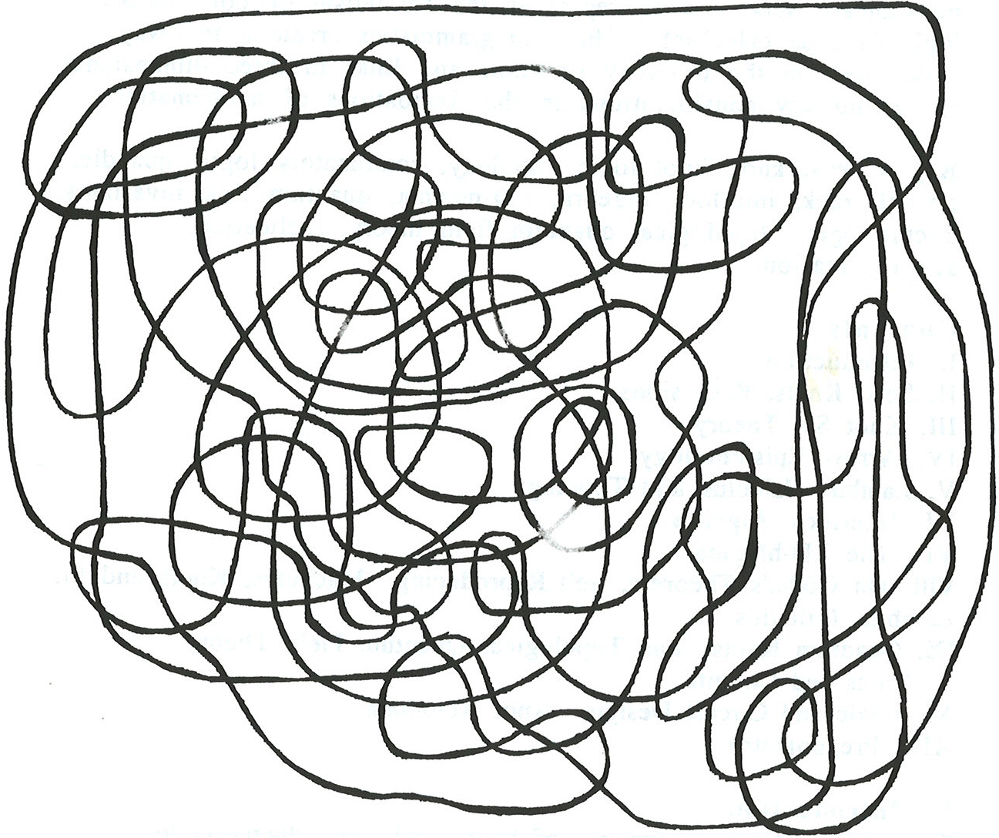

---

# Knot Logic

by Louis H. Kauffman

Department of Mathematics, Statistics and Computer Science 851 South Morgan Street University of Illinois at Chicago, Chicago, Illinois 60607-7045 e-mail: U10451@UICVM.BITNET

**Abstract.** Knot and link diagrams are used to represent nonstandard sets, and to represent the formalism of combinatory logic (lambda calculus). These diagrammatics create a two-way street between the topology of knots and links in three dimensional space and key considerations in the foundations of mathematics.

**Key Words.** knot, knot logic, topology, combinatory logic, quandle, crystal, rack, interlock algebra, LD-magma, quantum link invariants, circuit logic, topological quantum field theory, replication, self-replication.

## Contents

I. Introduction

II. Sets, Knots, Recursions

III. Knot Set Theory

IV. Arrow Epistemology

V. Lambda Calculus and Topology

VI. Interlock Algebra

VII. The LD-Magma

VIII. On Gödel's Theorem, Self-Reproducing Machines, Knots and the Lambda Calculus

IX. Quantum Knots and Topological Quantum Field Theory.

X. Knots and Circuits

XI. Logic and Circuit Design - Knot Automata

XII. Pregeometry

## I. Introduction

This paper introduces the use of knot and link diagrams for representing nonstandard sets and also for representing the formalism of combinatory logic (lambda calculus). These diagrammatics create a two-way street between the topology of knots and links in three dimensional space and key considerations in the foundations of mathematics. The paper explores the relationship

---

of this foundational study with the structure of quantum link invariants and with applications of knot theory to biological structure.

Section II reviews concepts of set theory from an original point of view, emphasizing the relative consistency of sets that do not satisfy the axiom of foundation - by constructing models in terms of notations, graphs and subsets of the plane. Section II also introduces ideas from knot theory and shows how to prove that you cannot cancel knots, just skirting paradox in the process. Section II includes a discussion of reentry and recursive forms in relation to knots, wild embeddings and fractals. An example is given of a sequence of graph embeddings whose complexity increases linearly, while an associated unlinking number is conjectured to increase exponentially. The section ends with a discussion of indicational calculi, non-standard logic, quantum logic and boundary logic.

Section III introduces knot set theory, a set theory whose membership relation is represented by one arc underpassing another. Knot set theory accomodates sets that are members of themselves and sets whose members are defined mutually. The diagrammatic representation of knot sets is so constructed that topologically equivalent diagrams represent the same set. One of the consequences in involving the topology in this way is that knot sets use a "fermionic" convention for the treatment of lists of identicals. The fermionic convention is that identicals cancel in pairs. Thus in the fermionic convention the set {a,a} is equivalent to the empty set. Ordinary set theory uses the "bosonic" convention that identicals condense in pairs (so that {a,a} = {a} in standard sets).

Section IV, discusses concepts of reference in relation to knot set theory.

Section V gives a construction that translates between knot diagrams and combinatory logic. In this formalism the broken arcs of the diagram are used to represent different elements in a lambda calculus, and the diagrams themselves naturally represent non- associative compositions of these elements. We show how to write key constructions in the lambda calculus such as the Church-Curry fixed point theorem in terms on these diagrams. We then investigate the relationship of this formalism with the topology and show how it is intimately related to the algebraic concepts of quandle, crystal and rack (See [J], [K6], [RF]) as used by knot theorists. The quandle,

---

crystal and rack are non-associative algebras that derive from a diagram of the knot and are topological invariants of it. In section VI we take this correspondence further by defining an extension of the crystal, the *interlock algebra* of a knot.

The interlock algebra is an algebra of lambda operators associated with the knot diagram. It is a topological invariant of the diagram and it contains complete information about the topology of the knot. Two knots are isotopic in three space if and only if their interlock algebras are isomorphic. The interlock algebra of a knot contains two types of lambda elements - those with no free variable and those with one free variable (multiple variables will occur in the case of a link). This presence of operators with free variables in the interlock algebra allows an intrinsic identification of subalgebras that are needed for the topology. The construction of the interlock algebra is an application of combinatory logic to topology. Section VI ends with a brief discussion of the classical Alexander polynomial.

Section VII discusses a problem in universal algebra - the structure of non-associative systems with a single non-commutative binary operation that admits a left-distributive law over itself: $a(bc) = (ab)(ac)$. These algebras are called *LD-magmas*. We have already met this condition in studying quandles in section 4. Here the left-distributive law is studied for its own sake. The word problem for free magmas was solved by Patrick DeHornoy in a beautiful and startling application of the Artin braid group. We sketch his method.

Section VIII sketches how the fixed point theorem for the lambda calculus is related to recursive forms, self-reference and Gödel's incompleteness theorem. This section contains a digression on forms of self-replication, including DNA, the Building Machine, the Mighty Simple Self-Rep and the Knot Logical Self-Rep (which turns out to be a picture of the syntax of the Building Machine). The self-replication of a knot is accomplished by a slide equivalence more drastic than the handle-sliding of Kirby calculus. The section ends with a description of Kirby calculus in this context.

Section IX is an introduction to the logic of Dirac brackets in the context of topological invariants. Section X discusses relations between knot theory, electricity and switching circuit theory. Section XI, on asynchronous automata, is a description of a domain in circuit design that has analogies with knot theory. In this context we see that quandles, crystals and racks (Sections 5 and 6) implicate a concept of knot automata.

---

Section XII explores pregeometry in the sense of John Wheeler. We make the case that knot and link diagrammatics are central to an appropriate conception of pregeometry. An appendix discusses the bracket model for the Jones polynomial.

The author would like to express his thanks to Louis Crane, Lee Smolin, Carlo Rovelli, Julian Barbour and John Wheeler for helpful conversations. Research for this paper was partially supported by the Program for Mathematics and Molecular Biology, University of California at Berkeley and by NSF Grant No. DMS 9205277.

## II. Sets, Knots, Recursions

It is customary either to build the theory of sets axiomatically, or to construct it from the intuitive concepts of membership and collection. It is well-known that a naive approach leads to paradoxes.

For example, the Russell set R is defined to be the set of all sets that are not members of themselves. X is a member of R exactly when X is not a member of X. On substitution of R for X, we find that R is a member of R exactly when R is not a member of R.

Initially, it is not clear whether the difficulty with the Russell set is in the notion of set formation, the idea of self-membership, the use of the word "not", the use of the word "all" or elsewhere. The Theory of Types [WhR] due to Russell and Whitehead placed the difficulty in the use of self-membership, and solved the paradox by prohibiting this and other ways of mixing different levels of discourse.

The Gödel-Bernays set theory (See [K], Appendix on Elementary Set Theory.) creates a different solution to the Russell paradox by making one large distinction between *set* and *class*. Of two sets A and B it can be said without ambiguity that A is a member of B, or B is a member of A, or neither is a member of the other. A class is a *set* if it is a member of another class. Classes are determined by their members, and classes can be defined in terms of properties: Given a property P, there exists a class C(P) equal to the class of all x such that P(x) is true and x is a *set*.

In this system, the Russell class is $$R = \{x \mid x \text{ is not a member of } x \text{ and } x \text{ is a set}\}.$$ Thus R is a class, but R is not a set.

---

In a system of the Gödel-Bernays type, there is nothing inherently wrong with self-membership. In fact, self-membership and other forms of contradiction of the "axiom of foundation" (which disallows infinite descending chains of membership.) are very interesting to explore using geometry, topology and diagrams. To this end, let us start from the beginning and construct some sets.

The empty set is commonly denoted by empty brackets: { }.

Notationally, sets indicated only through brackets are a subcollection of all the ways of making well-formed brackets:

A finite expression E in brackets is well-formed if

1. E is empty.

or

2. E = { F } G where F and G are well-formed.

These two rules give a complete characterization of the well-formed bracket expressions. A *finite ordered multi-set* S is an expression in the form

S = {T} where T is any well-formed expression. It follows that T = A₁ A₂ ... Aₙ where n is a positive integer, and each Aᵢ is a finite ordered multi-set. The Aᵢ's are the *members* of S.

We write the members of S without commas between them.

For example, if S= {{ } {{ }}}, then the members of S are { } and {{ }}.

A multi-set may have a multiplicity of identical members as in

$$
X = \{ \{ \} \{ \} \{ \} \} .
$$

Ordered multi-sets are equal exactly when they have identical sequences of brackets. To emphasize this point, let L denote a left bracket, { , and R denote a right bracket, } . Then the set X above is encoded by the sequence LLRLRLRR.

To obtain the usual category of finite sets, factor the ordered multi- sets by the equivalence relation generated by XY = YX and XX = X where X and Y are well-formed expressions. It then follows from our definitions that two finite sets are equal exactly when they have the same members.

---

It is easy to see that the class of ordered finite multi-sets is isomorphic to the class of rooted planar trees - by graphical duality as indicated below.

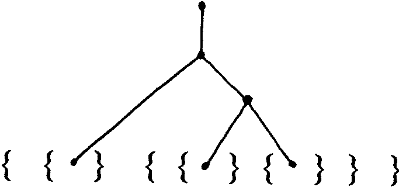

Another way to think of these sets is to replace each pair of brackets by a rectangle in the plane. Then any set is a collection of disjoint rectangles, with a single outermost rectangle - the set boundary. The members of the set are delineated by the rectangles inside this outermost rectangle that are outermost or at the same level as all other rectangles in the pattern. The tree is still obtained by graphical duality as shown below.

In both cases there is a natural notion of depth obtained by counting crossings inward from the outermost rectangle, or by counting nodes from the root of the tree. The equivalence relation on rectangles that generates finite sets is: *take the collections of rectangles up to homeomorphisms of the plane.* Here we use a sophisticated concept to define an elementary one. The use of this will become apparent at

---

once when we enlarge the category and obtain a model of non-standard sets.

Let FIST (First Infinite Sets) denote the class of (not necessarily finite) disjoint collections of rectangles in the plane such that each collection S has a single outermost rectangle, and the collection of rectangles inside that outermost rectangle is a disjoint union of elements of FIST (These are the members of S.) If A and B are in FIST, then we shall say that $A=B$ if there is a homeomorphism of the plane that carries A to B.

Call a collection of rectangles in the plane, taken up to homeomorphism of the plane, a *form*. Thus, finite (and some infinite) sets can be interpreted as forms, but not all forms are sets. In any form we can say unambiguously of two rectangles whether one is inside or outside of the other.

Forms can be framed and juxtaposed.

Let $\{X\}$ denote the result of putting a rectangle around the form X. Call this operation the *framing* of the form X. Let XY denote the *juxtaposition* of the forms X and Y. To get multi-sets from forms, consider forms that are framed. For example,

0. $\{ \}$
1. $\{ \{ \} \}$
2. $\{ \{ \} \{ \} \}$
3. $\{ \{ \} \{ \} \{ \} \}$

   ...

can be regarded as a list of multisets, with 0,1,2,3,... members. No commas are needed in the internal list of a set represented in this fashion. One simply searches for the different frames at depth 1, to get the list of members. (The depth counts the number of crossings made inward from the outermost region in the form.)

In FIST the simplest element that is a member of itself is shown below and denoted by the letter J. J is an infinite nest of rectangles, or an infinite linear tree.

---

Note that $J = \{ J \}$ where we interpret the brackets as the addition of the outer rectangle. There is nothing inherently infinite about the description $J= \{ J \}$, but its recursive unfolding leads to an infinite construction corresponding to an infinity of nested brackets:

$$
J = \{ \{ \{ \{ \{ \{ \dots \} \} \} \} \}
$$

With this rectangle model in mind, consider elements of FIST that are defined by systems of equations. For example, $A = \{ \{ \} B \}$, $B = \{ A \}$ yields

$$
\begin{align*} 
A &= \{ \{ \} B \} = \{ \{ \} \{ A \} \} \\ 
&= \{ \{ \} \{ \{ \} \{ A \} \} \} \\ 
&= \{ \{ \} \{ \{ \} \{ \} \{ \} \{ \} \{ \} \{ \} \dots \} \} 
\end{align*}
$$

A and B correspond to non-homeomorphic systems of rectangles, and so give a pair of distinct but entangled sets in FIST.

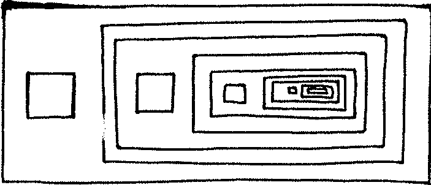

**Reentry Notation, Recursive Forms and Infinite Regress.** A set that is a member of itself can be diagrammed as a set with an arrow pointing into the inside of the set where the self inclusion occurs (Compare [K16].)

---

$$
M = \{ M \} = \{ \searrow \}
$$

In this form, one tends to take a model of infinite regress or recursion as in

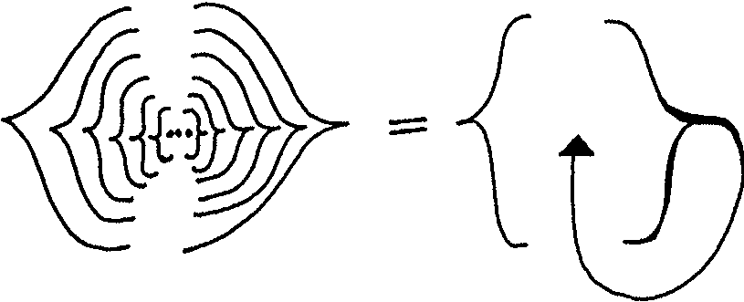

Similarly, in the case of interlock ( a={b}, b={a} ) we have a= {{a}} and the reentry description

$$
a = \{ \searrow \}
$$

$$
a = \{ \searrow \} = b
$$

The reentry concept goes beyond set formation to a domain of recursive forms. To indicate recursive forms that are not necessarily interpreted as sets it is convenient to use a rectangular box notation. Thus we write

---

$$
J =
$$

and

$$
F = \boxed{\phantom{000}} F \boxed{\phantom{000}} = \boxed{\phantom{000}} F \boxed{\phantom{000}}
$$

The second recursive form, $F$, can be called the *Fibonacci Form* since the number of divisions of this form at depth $n$ is the $n$th Fibonacci number. (The form divides the plane into disjoint connected regions. These are the *divisions* of the form. A division is said to have *depth* $n$ if it requires $n$ inward crossings of rectangle boundaries to reach that region from the outermost region in the plane. Each rectangle divides the plane into a bounded region and an unbounded region. A crossing of the boundary of a given rectangle is said to be an *inward crossing* if it goes from the unbounded region to the bounded region.)

To see this and other facts about the divisions of a form, let $F_n$ denote the number of divisions of an arbitrary form $F$ at depth $n$.

Then, for any forms $X$ and $Y$,

$$
1. (XY)_n = X_n + Y_n
$$

$$
2. \{X\}_n = X_{n-1}.
$$

---

In the case of the Fibonacci form, we have $F=\{{F}^2\}$. Hence $F_n = F_{n-2} + F_{n-1}$. Since $F_0 = F_1 = 1$, this proves our assertion about the Fibonacci series as the depth counts of the Fibonacci form.

From here it is quite natural to define the *growth rate*, $\mu(F)$, of a form $F$ as the limit of $F_{n+1}/F_n$ as $n$ goes to infinity.

$$
\mu(F) = \lim_{n \to \infty} (F_{n+1}/F_n).
$$

The growth rate of the Fibonacci form is the golden ratio, $(1 + \sqrt{5})/2$.

Recursive forms and their growth rates are intimately related to fractals. For example, the Koch fractal reenters its own indicational space in four major places as shown below.

---

We schematically indicate the structure of the Koch fractal by the recursive form $K = \{K \{KK\} K\}$. Extra brackets have been placed inside this form to indicate the special grouping of the middle two copies of the Koch fractal. These copies are the triangular pushout in the fractal itself. This recursive form can be regarded as the *pregeometry* of the fractal. It contains skeletal information about the fractal, but does not describe the geometry of its actual construction. The fractal dimension of the Koch fractal is encoded in its recursive form. The fractal dimension of the Koch is $\text{Log}(4)/\text{Log}(3)$. Four (4) is the growth rate of the form $A=\{AAAA\}$ and three (3) is the growth rate of the form $B=\{BBB\}$. K itself can be viewed as an A by seeing it as a repetition of 4 copies (this is the duplication rate). K can also be viewed as a B by seeing it as an internal group of three (this is the shrink rate in the geometry). The fractal dimension is the ratio of the logarithms of these two growth rates related to the recursive form.

---

## Alexander's Horned Sphere

Now we go to topology and look at the reentry form associated with the famous Alexander Horned Sphere [HY]. The schematic for this construction is illustrated below.

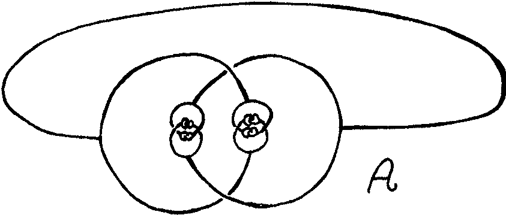

This infinite graph can be described as a reentry form as shown below.

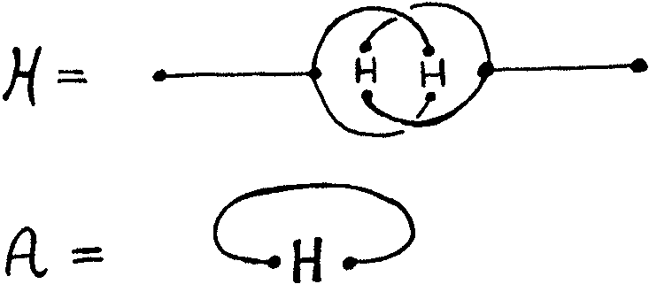

The limit of this construction produces a wildly embedded tree in three-space that is self-linked (i.e. the fundamental group of the complement of this tree is non-trivial). Any finite stage of the construction produces an unlinked embedding of a tree. The Alexander Horned Sphere is obtained by taking a limit of the boundaries of tubular neighborhoods of the finite trees in this construction. It is an embedding of a two dimensional sphere into three dimensional space such that the inside of the sphere is simply connected, but the outside is not simply connected.

---

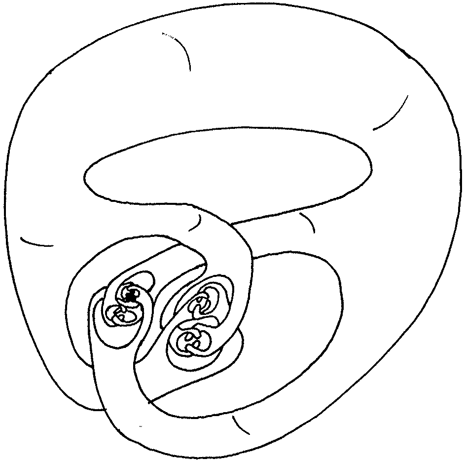

The most remarkable thing about the horned sphere is that it is a sphere. The limit construction does not touch itself anywhere. There is a Cantor's set worth of wild points on this embedded sphere such that any neighborhood of a wild point contains infinitely many branches of the structure.

An example of recursive unlinking. Consider the graph embedding shown below.

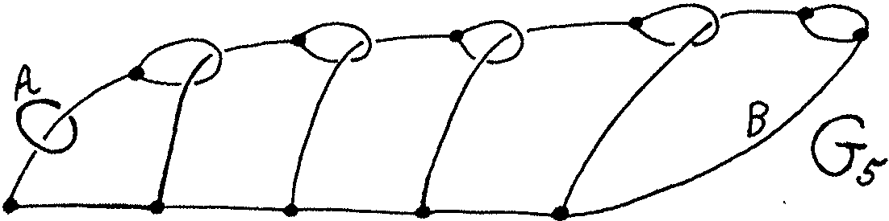

---

This is a special case of the graph embedding $G_n$ where $n$ is equal to 5. In $G_n$ there is a series of $n$ hoops, each one successively slipped through the previous one, all tied together at their bases, and so that the arc B is attached from the last hoop to its own base. Suppose that it is desired to unlink the circle labelled A from this graph under the stipulation that A is allowed to make crossing exchanges only with the arc labelled B. One can perform any isotopy of the embedding coupled with these allowed crossing changes. Then 1 conjecture that $G_n$ requires at least $2^{n-1}$ crossing exchanges with B in order to become unlinked. If this conjecture is true, then we have an unlinking problem whose complexity goes up exponentially, while the complexity of the underlying graph embeddings that support it goes up linearly. This example shows how the sort of recursive construction associated with an object like the horned sphere can pose an actual complexity problem in topology for the finite stages of the recursion.

The isotopy shown below of $G_5$ to a graph $G'$ with the hoops unentangled, should give the reader a glimpse of evidence for this conjecture. It is clear that A can be unlinked from $G'$ by $2^4$ exchanges. Hence, up to isotopy, A can be unlinked in $G_5$ by $2^4$ exchanges. A similar construction shows that A can be unlinked in $G_n$ with $2^{n-1}$ exchanges. We conjecture that this procedure is minimal.

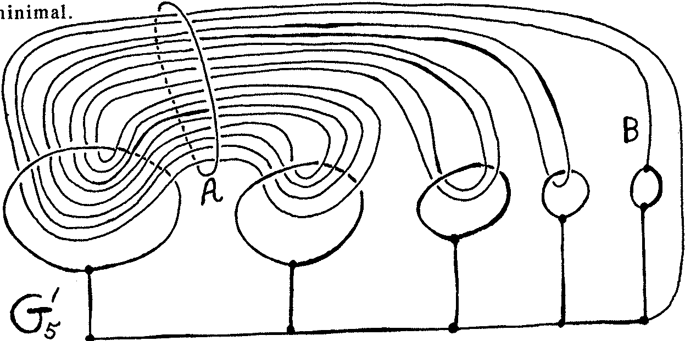

---

## The Method of Infinite Repetition

There is a technique in topology called the method of infinite repetition. It begins with the paradox:

$$
\begin{aligned}
0 &= (1-1) + (1-1) + (1-1) + (1-1) + \dots \\
&= 1 - 1 + 1 - 1 + 1 - 1 + \dots \\
&= 1 + (-1+1) + (-1+1) + (-1+1) + \dots \\
&= 1 + 0 \\
&= 1.
\end{aligned}
$$

**Theorem.** Let it be assumed that infinite sums make sense and that $a+b = b+a$ and $x+(y+z) = (x+y)+z$, $0+x=0$ for all $a,b,x,y,z$. Then $a+b = 0$ implies that $a=0$ and $b=0$.

**Proof:**

$$
\begin{aligned}
0 &= 0 + 0 + 0 + 0 + \dots \\
&= (a+b) + (a+b) + (a+b) + \dots \\
&= a + b + a + b + a + b + \dots \\
&= a + (b+a) + (b+a) + (b+a) + \dots \\
&= a + 0 + 0 + 0 + \dots \\
&= a.
\end{aligned}
$$

Similarly, $b=0$. This completes the proof.//

Of course, for numbers, infinite sums do not necessarily make sense, and so we have not proved that zero equals one. There are, however, topological applications to this formalism. Here is an example: Let $M$ and $M'$ be (compact orientable) surfaces. The connected sum of $M$ and $M'$, $M\#M'$, is obtained by excising a disk from each surface and connecting them to each other by a tube whose ends are glued to the circular boundaries of the two regions left by the excision in each surface.

---

We shall prove, by infinite repetition, the

**Theorem.** $M\#M' = S^2$ implies that $M = S^2$ and $M' = S^2$.

Here $S^2$ denotes the surface of a two dimensional sphere (the boundary of a three dimensional ball.) and $\# = $ denotes homeomorphism of surfaces. It is easy to check that $M\#S^2 = M$ for any surface $M$ and that the connected sum operation is well-defined for finite sums, and that it is commutative and associative. Can we make sense of an infinite sum? The answer is yes, but one leaves the category of compact surfaces: Put the surfaces $M_1, M_2, M_3, \dots$ in a row extending to the (viewer's) right. Form $M_\infty = M_1\#M_2\#M_3\#\dots$ by connecting them together by straight tubes between adjacent surfaces. The resulting surface $M_\infty$ is well-defined but no longer compact. For example $S_\infty = S^2\#S^2\#S^2\#\dots$ is homeomorphic to the plane $R^2$.

In this case an infinite sum of "zeroes" is not zero! However, for any surface $M$, $M\#S_\infty = M-\{pt\}$, since removing a point is equivalent to the connected sum with $R^2$. Thus:

If $M\#M' = S^2$, then

$$
\begin{align*} 
S_\infty 
&= (M\#M')\#(M\#M')\# \dots \\
&= M\#(M'\#M)\#(M'\#M)\#\dots \\
&= M\#(S_\infty) \\
&= M-\{pt\}. 
\end{align*}
$$

Now form the one-point compactification of both sides and conclude that $S^2 = M$.

Because $S_\infty$ is not the 2-sphere, we cannot use this argument to conclude that if $M\#M'$ is smoothly homeomorphic to the 2-sphere, then $M$ is smoothly homeomorphic to the 2-sphere. Differentiability may fail in the neighborhood of the missing point. In fact, for surfaces the theorem still holds in the smooth category, but the

---

same argument transposed to higher dimensions has this limitation. For example in dimension 7, there are manifolds M and M' homeomorphic to spheres but not diffeomorphic to spheres such that M|M' is diffeomorphic to the standard 7 sphere (See [KM]).

You Can't Cancel Knots

Tie a knot in a piece of rope and then tie another knot adjacent to it. (In this picture of knots, one is *not allowed* to move any rope past the end points. Think of the end-points as attached to opposite walls of a room. With the ends attached to the wall, the rope can be moved so long as it is not removed from the wall or torn apart.)

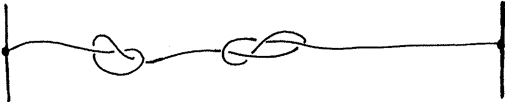

Is it possible that the two knots taken together can undo one another even though they are individually knotted? The answer is NO. The proof is by infinite repetition [F]: Let O denote the unknot. Let K#K' denote the connected sum of knots obtained by adjacent tying. Instantiate K∞ = K#K'#K#K'#K#... as an infinite weave in a compact space by introducing a limit point as shown below.

Then $K_\infty$ is, by the method of infinite repetition, equal to both K and to O. Hence K must be unknotted.

This argument goes into the larger category of knots with infinite amounts of weave to make its conclusions. In order to show that the

---

conclusion holds in the usual category of finite weaves, a topological theorem is needed stating that if finitely woven knots are equivalent in the larger category of infinite weaves then they are equivalent in the category of finite weaves. The result that supports this conclusion is found in [MO].

The Conway Proof

There is a very beautiful proof of the impossibility of knot cancellation due to John Conway (See [G].). His proof does not go off into infinite weave. Here is a sketch of Conway's proof:

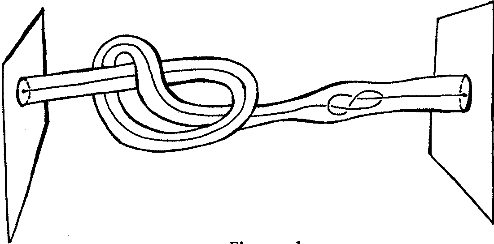

Figure 1

Put a tube T around K#K' (as shown in Figure 1 above) so that the tube is a tubular neighborhood of K and so that the tube engulfs K'. If K#K' = O, then there is a homeomorphism of the room to whose walls K#K' is attached that leaves the walls of the room fixed, and straightens K#K' to a straight line L extending from the left wall to the right wall. The tube T will be deformed by this homeomorphism to a new tube T' that does not intersect the line L. Let P be plane in the room containing L. Then P intersects the left and right walls of the room in the endpoints of L and in four points of the tube T' (two on each wall). Let a and b denote the intersection of P with T' on the left wall and let c and d denote the intersection of P with the right wall. Then P intersects T' in arcs that emanate from a,b,c,d and some closed curves in P. The arc from a cannot reach either b or d because it is separated from these points by the line L in the plane P. Therefore the arc from a must extend to c. This arc AC from a to c is necessarily unknotted in the room, since it is a non-self-intersecting arc in the plane P. However the arc AC is the image under the homeomorphism of an arc extending from one end of the tube T to

---

the other, and by construction, this means that the arc AC must be equivalent to the knot K (since the tube is knotted in the pattern of K). Therefore we have shown that in the course of unknotting K#K' we have necessarily unknotted K itself! Therefore you cannot cancel knots.//

Figure 2

## Graphs that Encapsulate Infinity

There is a very elegant way to represent sets in FIST that are described by systems of equations: Any directed graph represents such a set.

Each node in the graph represents a set. An edge directed from node A to node B encodes the relation that *B* is a *member* of *A*.

(This method of representation is used by Aczel [AC].)

A single finite set is a rooted tree where all the edges are directed away from the root as in the examples preceding this discussion. Nevertheless, any directed graph yields a set, or sets. For example,

---

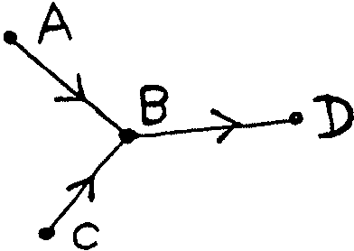

Here $A = \{B\}$, $B = \{D\}$, $C = \{B\}$, $D = \{\}$. (A node with no outwardly directed edges denotes the empty set.) In this case, we see that $A = \{\{\}\}$, $B = \{\}\}$, $C = A$, $D = \{\}$. The symmetry of the graph with respect to the nodes A and C corresponds to the equality of the corresponding sets.

The set $J = \{J\}$ is represented as a node with a self-directed edge.

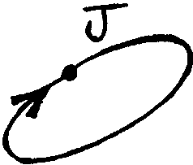

The category of sets in FIST that are represented by finite directed graphs is pleasant to contemplate, but it only scratches the surface of FIST. For example, the following infinite tree has no finite graph description:

---

Here are a few more examples:

1. $A = \{B\}$ and $B=\{A\}$.

Here the corresponding sets in FIST are identical since we obtain $A= {{{{....}}}}$ and $B = {{{{....}}}}$. We may wish that this graph represented two distinct sets A and B that mutually create one another. This end can be achieved by taking the graphs at face value, rather than accepting the model involving these recursive limits as the end of the story. In the next section we shall do just this in the context of knot sets. In the FIST context, one can obtain the effect of distinguishing A and B by giving one a different membership structure from the other via a "label" as in $A = \{B, \{ \}\}$ and $B = \{A\}$.

2. $F=\{\{F\}F\}$.

The solution in FIST is $F = {{{{...}}}} {{{{...}}}}$. This is the Fibonacci form (considered earlier in this section).

4. Consider the set in FIST specified by the graph shown below

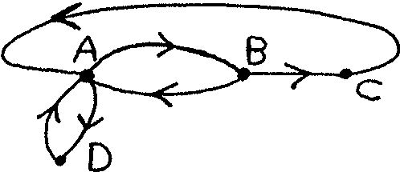

---

The corresponding system of equations is

$$
\begin{align*}
A &= \{B,D\} \\
B &= \{A,C\} \\
C &= \{A\} \\
D &= \{A\}
\end{align*}
$$

The last two equations force C=D, and these then force A=B. Thus the system is equivalent to the system A={A,D} and D= {A} or to the graph

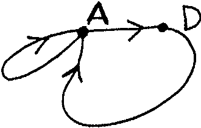

This example shows how different graphs can lead to the same elements of FIST. It is an interesting question to determine the minimal graphs that represent a given system of mutually defined sets in FIST. The nodes of such a directed graph are mutually distinguished from one another in terms of the mutual membership relations. An analogy to this situation for undirected graphs is found in the extremal variety graphs of Barbour and Smolin [BaS]. In an extremal variety graph, all points are distinct due to the presence of distinguishing neighborhood structures in the unoriented graph. Thus, the extremal variety graph represents a space in which the points are distinguished from one another due entirely to their mutual relationships. Minimal directed graphs for sets in FIST are an oriented analog of the extremal varieties.

Pregeometry

These remarks look forward to the discussion of pregeometry in section 10. A minimal directed graph or a maximal variety graph can be regarded as a miniature world in which the nodes are the observers. Each observer obtains its identity from its relations with the other observers. In the case of directed graphs, each observer's immediate perception is of its members (the nodes that are one directed edge away). Further reports yield the members of members and eventually the full system of relationships that constitute this world. The problem of pregeometry is how it can come to pass that such worlds acquire geometry and topology that is natural with respect to the structure of relations, and giving rise to known physical law. It is our contention (see Section 10) that knot theory gives a new way to consider the question of pregeometry.

---

In the next section, we discuss a representation of sets that interfaces with knots and links in three dimensional space. We conclude the present section with two general remarks about the models with which this section began.

### Remark 1. Indicational Calculus, Boolean logic and the Calculus of Indications.

We have seen that the full set of well-formed parenthesis structures is a background of the theory of finite sets. Let us denote these structures modulo the relations $XY=YX$ and $XX=X$ by parentheses written in angle-bracket form. Thus `<<><>> <> >` = `<<><>> <> <<>> >` = `<<><>> >` denotes the set whose members are an empty set and a set consisting of an empty set. The expression `<<>><>` is a form but not a set in the terminology used earlier in this section. Now consider the quotient of the class of forms generated by the extra relation `<<>> = e` where e denotes the empty word. Let `=` continue to denote this equivalence relation. Then `<<>><> = <>` and `<<>> =` where the blank space is the empty word. All finite forms fall into the two distinct equivalence classes corresponding to the empty word `>` and the mark `<>`. We represent these classes by `<<>>` and `<>`.

The collection of forms up to this new equivalence satisfy many equations. For example, `<<X>> = X` for any X and `<X>X = <>` for any X. By interpreting `<X>` as the *negation* of X, XY as X or Y, `<<X><Y>>` as X and Y, `<<>>` as False, `<>` as True, one recovers the full structure of Boolean algebra. This is the calculus of indications of G. Spencer-Brown [S-B] expressed in parenthesis notation. Boolean algebra arises from the boundary structure of finite set theory. The calculus of indications begins with well-formed parenthetical expressions modulo the equivalence generated by

$`<><> = <>` and `<<>> =`.

These equivalences can be performed within otherwise identical larger expressions.

---

## Imaginary Boolean Values

Infinite expressions in the context of the calculus of indications, give non-Boolean values. For example, if $P = <<<...>>$, then $P = 
$. Infinite expressions are not necessarily reducible to one of the two states $<<<>$ or $<>$. It is an interesting problem to enlarge the context of Boolean algebra to handle such values. See [K15], [K16], [K17], [KV] for a discussion of solutions to this problem. Spencer-Brown [S-B] makes the perspicuous observation that there is a direct analogy between the imaginary Boolean value $P = 
$ and $i$, the square root of minus one: $i$ is the solution to $i = -1/i$. If we ask to solve $x = F(x)$ with $F(x) = -1/x$, then $x=1$ implies $x = -1$ and $x=-1$ implies that $x = 1$. The problem of finding a square root of minus one is analogous to the liar paradox. Complex numbers provide a solution to this paradox in the numerical domain. Just so one can consider imaginary values in logical domains.

The solution $P=<<<...>>$ to $P = 
$ is the analog of the solution $x = a + b/(a + b/(a + ...))$ for $x = a + b/x$. In the case where $a=0, b=-1$ there is no real numerical value for this continued fraction. When $x^2 = ax + b$ has a real root, then the continued fraction converges and gives a real answer. When $x^2 = ax + b$ does not have a real root then the continued fraction does not converge, but the recursion $x \rightarrow a + b/x$ is quite interesting to study in its own right, producing an intriguing class of oscillations of the form $x_{n+1} = a + b/x_n$. (Exercise: show that these oscillations all take the form $x_n = \tan(n\theta + \Phi)$ for appropriate choice of theta and phi depending upon $a$ and $b$.) In Figure 3 we show a typical plot of $x_n$ (vertical axis) against $n$ (horizontal axis) in the case where $x^2 = ax + b$ has no real root. (Here the starting value for $x$ is 1 and $a=1, b=-6$.)

---

Figure 3

Paradox can be studied through the recursive process inherent in its syntactic form. (See [K16], [K17], [KV], [H1], [H2].) In the case of the complex numbers it is interesting to point out that the view of the square roots of minus one as oscillations between 1 and -1 is mirrored in the matrix representation of these roots by the matrices whose squares are minus the identity.

$$
\begin{pmatrix} 0 & 1 \\ -1 & 0 \end{pmatrix} \quad \text{and} \quad \begin{pmatrix} 0 & -1 \\ 1 & 0 \end{pmatrix}.
$$

In thinking about the square root of minus one, one must ask which one (i or -i)? Similarly, in regarding the imaginary value $P = 
$, one encounters two oscillations. There are two corresponding sequences, depending on whether the starting value is 0 or 1. These solutions can be formalized as ordered pairs of Boolean values [a,b] with $[a,b]' = [b',a']$, and $[a,b][c,d] = [ac,bd]$. Let $I=[0,1]$ and $J=[1,0]$. Then I and J are the two views of the alternation ...0101010101... with $I'=I, J'=J$ and $IJ=[0,0]=0$. This construction gives a DeMorgan Algebra [K15],[K16], [KV]. As we shall see later in

---

this essay (section 10) an entirely different world opens up if we ask for the same conditions, but IJ=0.

**Remark2. Quantum Logic**

Recall the simplest form of quantum logic (See [F1] ,[F2],[F3], [O]) based on a vector space V with a notion of orthogonal complement for subspaces (W' is the orthocomplement of W). Elements in the algebra of this logic are subspaces of V. The negation of W is its orthocomplement W'. The sum of subspaces A and B (A+B) is the subspace spanned by A and B in V. The product of A and B (A*B) is their set theoretic intersection. Let 1 denote V and 0 denote the zero subspace.

In this logic, we have A+A' = 1, A*A' = 0 for any A. The law of the excluded middle still holds, and there is no element J in the logic such that J'=J. On the other hand, if V is two dimensional, and P and Q represent perpendicular lines in V, while R represents a line independent from both P and Q then we have 1= 1*R = (P + Q)*R while P*R + Q*R = 0 + 0 = 0.

The distributive law does not hold in the quantum logic.

Such a non-Boolean logic is called a quantum logic because it models the operations of states and projections in a quantum mechanical system. Addition of vectors corresponds to the superposition of states. Here we are concerned not with the naturality of this structure with respect to quantum mechanics, but rather with its naturality in respect to mathematical foundational ideas. Vector spaces are a rather late development in the hierarchy of mathematical constructions. Can one encounter quantum logic nearer to the bottom? One answer is an appeal to geometry. If we describe in notation this move to quantum logic it becomes: Let (for three dimensions) the whole space, a plane, a line or a point indicate a given proposition. Let the negation of this proposition be indicated by a linear space that is perpendicular to the indicator for a given proposition. Thus, in a plane, if we diagram P by a line

then P' is a line perpendicular to P.

---

At once there arises the infinite multiplicity of lines in between P and P'. If the plane itself is all (1) and a point the void (0), then we can only save the law of the excluded middle by letting P+P' indicate the plane spanned by these two lines. It is nevertheless this very existence of intermediates that makes the logic non-distributive. For we take R to be a line going straight between P and P', and we find that R*(P+P') is not equal to R*P + R*P'. The quantum logic is the logic of the first movement of notation into geometry.

Quantum logic is the pre-geometry of notation. Boolean logic is obtained in notation by ignoring the existence of intermediate states.

This discussion makes no claim that its remarks about notation and quantum logic have a direct bearing on quantum mechanics. Such issues deserve more exploration.

### Remark 3. Ordered Parentheses, Boundary Logic and the Temperley Lieb Algebra

In this section we have taken the point of view that ordered parenthetical expressions in brackets (finite ordered multi-sets) are precursors to finite set theory. In examining the structure of such expressions it is useful to tie left and right ends of the parenthesis into a single form that shall be called a *cap*. This notational device is indicated below.

Call parenthetical expressions written in this notation *capforms*. The capforms are intimately related to a number of topological problems. One way to see this is to draw a simple closed curve (i.e. a

---

curve with no self-intersections) in the plane and slice it with a straight line. the line cuts the curve into two capforms such that the feet of each cap are on the line.

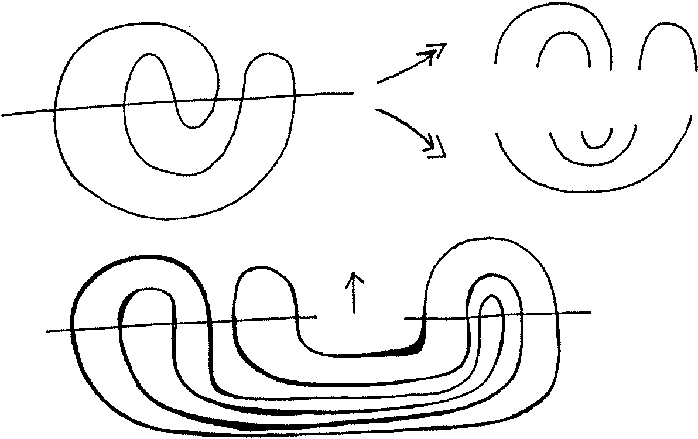

The interaction of these two capforms produces the single simple closed curve. In fact, we formalize the interaction of the two capforms as a cancellation (or connection) of nearby boundaries. We indicate nearby interacting boundaries by an arrow.

$$
\textcircled{2} \textcircled{1} \textcircled{3} = \textcircled{2} \textcircled{1} \textcircled{3}
$$

$$
\textcircled{2} \textcircled{1} \textcircled{3} = \textcircled{2} \textcircled{1} \textcircled{3}
$$

$$
\textcircled{2} \textcircled{1} \textcircled{3} = \textcircled{2} \textcircled{1} \textcircled{3} = \textcircled{2} \textcircled{1} \textcircled{3}
$$

$$
\textcircled{2} \textcircled{1} \textcircled{3} = \textcircled{2} \textcircled{1} \textcircled{3}
$$

---

This gives rise to the following rules in a calculus of capform boundaries that we call *boundary logic* (See [BRI] for a distinct but related use of this term.).

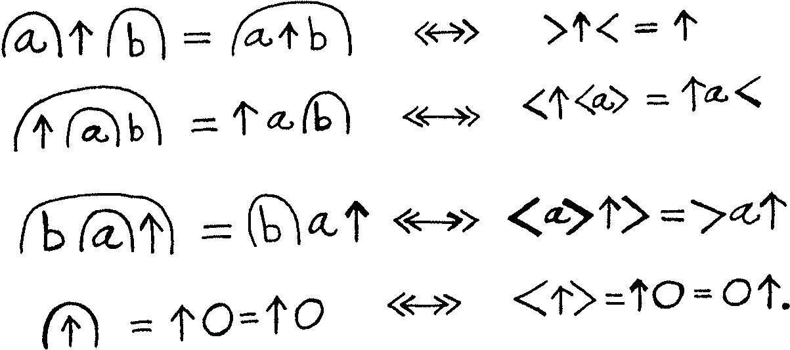

To determine whether two capforms interact to produce a single simple closed curve, one can either calculate in boundary logic or draw geometric connections and trace the resulting plane curves:

**Remark.** By using the boundary logic in parenthetical form, we can formalize it with rules for string replacements. Then the equivalent of the above graphical calculations can be performed by a digital computer. (See [K6], Appendix to Second Edition, pp. 605-608.)

If $C_n$ denotes the capforms with $n$ caps, define a binary operation $C_n \times C_n \rightarrow C_n$ by $X\#Y = X |^n Y$ where $|^n$ denotes the $n$-fold iteration of the boundary joining operation. This product operation can be described quite explicitly by regarding a capform in $C_n$ as having $n$ left legs and $n$ right legs. $X\#Y$ is the result of joining the right legs of X to the left legs of Y as shown below.

---

The structure of this product on $C_n$ is better understood by rewriting the elements of $C_n$ so that the left legs appear at the top of a box, and the right legs appear at the bottom.

Then one can verify that every capform is a product of the elementary capforms shown below. These forms are the generators of the (diagrammatic) Temperley-Lieb algebra [K3], [K6].

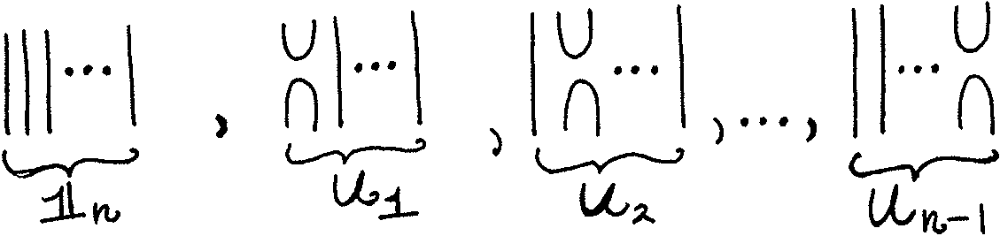

The following relations describe this algebra

$$
\begin{align*}
U_i U_{i+1} U_i &= U_i, \\
U_i U_{i-1} U_i &= U_i, \\
U_i U_j &= U_j U_i \text{ if } |i-j|>2, \\
(U_i)^2 &= dU_i.
\end{align*}
$$

---

Here d denotes the value assigned to a single free loop (the loop is taken to commute with other elements of the algebra.)

The last relation is illustrated below.

$$
\begin{tikzpicture}[baseline=(current bounding box.center)]
\draw (0,0) circle (1);
\node at (-0.5,0) {U};
\node at (0.5,0) {U};
\node at (0,1) {O};
\node at (0,0) {N};
\draw[->] (0.5,0) -- (0,1);
\node at (0.5,0.5) {$\omega_i^2$};
\node at (0.5,0.5) {$d\omega_i$};
\end{tikzpicture}
$$

The Temperley-Lieb algebra originated in certain problems in statistical mechanics (See [BX].), and it has a very strong influence on many problems in the theory of knots and links.

The fundamentals of set theory are intimately connected, through combinatorial structures and the theme of boundaries, with logic, topology and mathematical physics. All this from framing nothing!

III. Knot Set Theory

A diagrammatic alternative to Venn diagrams can model a non- standard set theory.

This section describes such a diagrammatic model and explains its relationship with the theory of knots and links in three dimensional space.

We begin with undefined objects denoted by letters a,b,c,... and a notion of membership denoted a ∈ b (a "belongs" to b). It will be possible for a to belong to itself (a ∈ a) or for a to belong to b while b belongs to a. In the model there is no infinite regress and the system, a formal diagrammatic theory, is consistent relative to standard discrete mathematics.

Here is a description of the model. Objects will be indicated by non- self intersecting arcs in the plane. A given object may correspond to a multiplicity of arcs. This is indicated by labelling the arcs with the label corresponding to the object. Thus the arc below corresponds to the label a.

---

Membership is indicated by the diagram shown below.

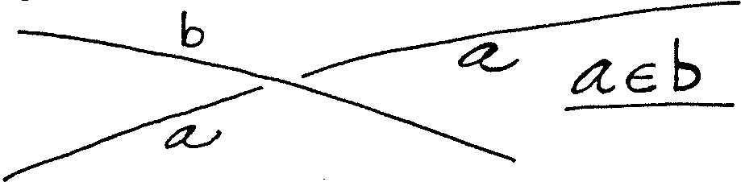

Here we have shown $a \in b$. The arc $b$ is unbroken, while a labels two arcs that meet on opposite sides of $b$. Following the pictorial convention of illustrating one arc passing behind another by putting a break in the arc that passes behind, one says that *a* *passes under* *b*. The pictorial convention is important both for the logic and for the deeper relationship with three dimensional space that we shall elucidate shortly.

It is an easy matter to illustrate certain basic constructions in set theory. For example, the von Neumann construction of sets of arbitrary finite cardinality is traditionally done by starting with the empty set $\emptyset = \{ \}$, and building a sequence of sets $X_n$ with $X_0 = \{ \}$, $X_1 = \{\{ \}\}$, $X_2 = \{\{ \}\}$, $\{\{ \}\}$.

Here $X_{n+1} = X_n \cup \{ X_n \}$ where $U$ denotes the operation of union. The diagrams below show how to implement this construction using the overcrossing convention for membership.

---

With these same diagrams it is possible to indicate sets that are members of themselves

and sets that are members of each other

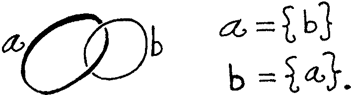

As they stand, these diagrams indicate sets that may have a multiplicity of identical members. Thus

Here $b = \{a,a\}$ and $a = \{\}$.

The traditional way to condense multiplicities of identicals is to regard them as all equivalent to one another. This amounts to the condensation rule `{ ... a,a ... } = { ...a... }`. In the case of our diagrams another solution is suggested. In this solution, *identicals cancel in pairs* and we have `{ ... a,a ... } = { ... ... }`. Thus `{a, a} = { }`. This is diagrammed as shown below:

---

It is easy to remember this diagrammatic transformation, since it can be interpreted as a drawing of one strand of rope being slipped out from under another. We shall accordingly adopt the rule of cancellation of identicals as fundamental to knot set theory.

## Digression on Knots.

The diagrams that we are drawing have a well-known interpretation as diagrams of knots, links and tangles in three dimensional space. By convention, a knot consists in a single closed curve, a link may have many closed curves and a tangle has arcs with free ends. Also by convention, topological changes in a tangle do not involve moving the free ends or in passing strands over the free ends.

There is a direct relationship between the topology of these knots, links and tangles and the properties of the knot set theory.

Reidemeister [R] proved that any knot or link in three dimensional space can be represented by a diagram containing only crossings of the type indicated below,

and that two knots or links (A knot is an embedding of a single closed curve into three space. A link is an embedding of a collection of curves into three space.) are isotopic in three space if and only if their diagrams are equivalent to one another under a finite sequence of transformations of the types I, II, and III as indicated below. (Isotopy corresponds directly to the physical picture of transforming one rope to another by pushing, pulling, stretching but no tearing.)

---

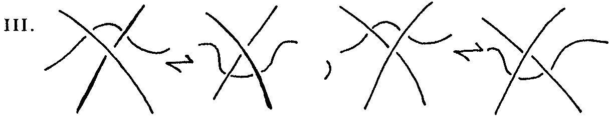

The same theorems apply to tangles, with the caveat that the free ends of the tangles remain fixed during the applications of the moves, and that strands are not allowed to pass over the ends of the tangles.

Here is a simple example of unknotting via the Reidemeister moves.

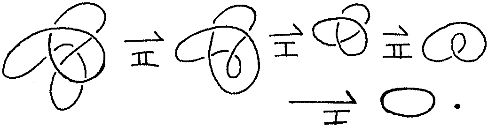

-36-

---

Here is a subtler example, turning the figure eight knot into its mirror image.

It is a very tricky matter to extract topological data about knots and links from their diagrams. We shall have more to say about this later.

**The Triangle Move.** The Reidemeister moves derive from properties of the projection of a curve from three-dimensional space to a plane or to the surface of a sphere. In fact Reidemeister had a *single* move for knots and links in three space. This single move, the *triangle move*, generates the three Reidemeister moves. The triangle move is defined for piecewise linear knots and links in three-space. A piecewise linear link is made up from finitely many straight line segments. Any link represented by a differentiable embedding, or any link that can be drawn by hand in a finite amount of time, can be approximated by a piecewise linear link. Given a pl (short for piecewise linear) link, a triangle move is performed by the following prescription:

Perform one of the following two types of operations.

1. Mark a straight segment A on the link K. Let r and s denote the endpoints of A. This segment A can be a proper subsegment or an entire segment of K. Let p be a point in the complement of the link K such that the triangle with vertices r,s,p intersects K only along A. Let B denote the segment rp and C the segment sp. Cut the segment A from the link and replace it by the union of the segments B and C. 2. Let B and C be consecutive segments marked on the link K. (By consecutive I mean that they share a single endpoint.) Let A be the segment determined by the endpoints of B and C that are not shared between them. Let ABC denote the triangle (surface) determined by

-37-

---

the segments A, B and C. Assume that ABC intersects K in exactly B and C. Then cut A and B from K and paste in C.

The diagrams below illustrate how projections of triangle moves generate the three Reidemeister moves. Two pl links in three dimensional space are ambient isotopic if and only if they can be related by a finite sequence of triangle moves. Careful consideration of the projections shows that sequences of Reidemeister moves on diagrams captures the content of an ambient isotopy.

I.

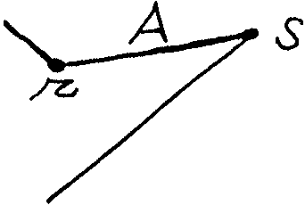

II.

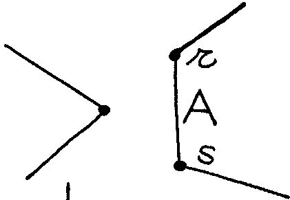

III.

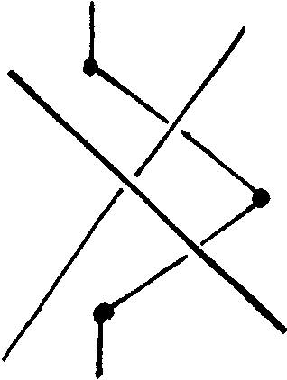

It is worth considering how the first Reidemeister move is generated by a simple triangle move. This shows clearly the illusory nature of self-membership from the point of view of three dimensional space if we stick to pure topology.

On the other hand, if the loop is actually a physical loop in a rope, then the cancellation of the loop shown in the first move must be paid for by a corresponding twist in the rope. This is most easily illustrated by replacing the line drawing by a drawing of a twisted band as shown below.

-38-

---

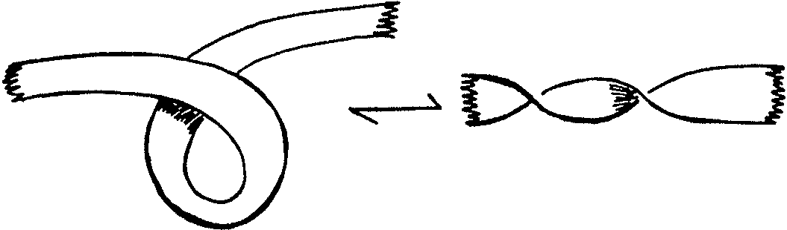

This band picture of the first Reidemeister move shows that we can regard it as an exchange rather than an elimination or creation of the loop.

The reason for dwelling on the first Reidemeister move in our context is that this move allows the creation or cancellation of self-membership in the corresponding knot set. If we take the point of view that the diagrams represent twisted bands (called framed knots and links), then the self-membership is not lost as we go to the topology. A corresponding equivalence relation on links is called *regular isotopy*. Regular isotopy is generated by the second and third Reidemeister moves. We shall return to this idea later in the discussion.

End of Digression.

Note that by the cancellation of identicals, diagrams related by the second Reidemeister move represent the same knot set. The third move does not change any membership relations. Finally, invariance of a knot set under the first Reidemeister move would entail quotienting the theory by self membership. As we have remarked above, it is natural to consider only equivalence of knots and links up to regular isotopy - the equivalence relation generated by the second and third Reidemeister moves - or to regard the diagrams as representative of embedded bands in space. In the latter case, self membership is catalogued by the twists in a thickened arc, as well as loops in that arc.

If we maintain the distinction of self-membership by using only regular isotopy on the diagrams, then the Russell paradox becomes meaningful in the knot set domain, but there is still a strange twist about self-membership. By the convention of cancellation of identicals we have the equivalence,

---

$X = \{X, X, C\}$ where $X=\{C\}$ is the reduced form of the knot set $X$, and $C$ denotes the contents of $X$. Any knot set has a representative that is a member of itself. It is only of the reduced forms for the knot sets that we can speak of a set that is or is not a member of itself.

The most radical interpretation is: Use diagrams with free ends (tangles) and allow the first Reidemeister move on knot sets. This means that any knot set has representatives that are members of themselves and it has representatives that are not members of themselves. The states of self-membership and non-self membership are equivalent. Up to representation, a (radical) knot set is a member of itself if and only if it is not a member of itself!

We have resolved the Russell paradox in this domain by having every set a member of itself and not a member of itself. The topological interpretation of knot sets shows that self-membership can be quotiented from the set theory (so that a given set has representatives that are members of themselves and representatives that are not members of themselves). The quotient theory is as consistent as the theory of knots and links in 3-space. Since this theory can be expressed in terms of ordinary set theory, this provides a relative consistency proof for radical knot sets.

Mutuality such as $a = \{b\}$, $b=\{a\}$ is another matter. Here there is no reduction to anything simpler, and topologically, mutuality corresponds to nothing more paradoxical than the linking of two space curves.

In this version of knot sets one can make a diagram of a given knot set, and then use this diagram as a weaving pattern for a physical weave. Throw that weave into three space. Flatten the weave back onto a plane. The result is an equivalent knot set. The information in a knot set is encoded into the topology.

---

## Knot Sets Avoid Infinite Regress

The knot set gives a way to conceptualize nonstandard sets without recourse to infinite regress. Infinity has been transposed into topology where inside and outside can equivocate through a twist in the boundary. In knot sets we obtain the multiple levels of ordinary set theory without the seemingly necessary hierarchy. This is nowhere more evident than in the self membering set represented by a curl.

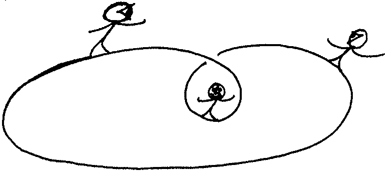

Here an observer on the curl itself will go continuously from being container to being member as he walks along the ramp. Membership becomes topological relationship.

**Remark.** The reader may be familiar with other non-standard models for set theory such as those in the book by Peter Aczel [AC]. The constructions given here are very close in spirit to those of Aczel. There are two major differences. The first difference is in our choice to handle identicals via cancellation rather than condensation. The second is in the background use of reentering forms to indicate recursively defined constructions. We do not utilize the same demand for uniqueness of labelling as in [AC]. This is a technical matter and will be discussed elsewhere. The surprise in our construction is that the theory has a topological interpretation.

The version of knot sets discussed herein has a precursor in the work of the Swedish logician Stig Kanger in the early 1940's ([P], pp. 13-14.). Kanger represented sets as cords - with a cord tied around another cord representing a set with the other cord as a member. A cord tied around itself becomes a set that is a member of itself. Our knot sets, based on the diagrams for knots, turn out to have a deeper relationship to the topology of knots than the Kanger system. Kanger's idea is very significant, and it is interesting to compare it to the earlier systems of numeration (Quipu) that are based upon tying knots in a rope.

---

## IV. Arrow Epistemology

### An arrow points.

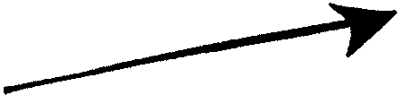

The arrow accomplishes its pointing via the distinction between inside and outside (convex side versus concave side) made by the arrow head. The body of the arrow extends the domain of the concave side into a flexible arm that can reach outward from the base of the arrow.

Once the body of the arrow becomes flexible, then elementary notational topology makes it possible for the arrow to point to itself. At this point, two forms of self pointing arise - pointing to the base (origin) of the body of the arrow and pointing to the interior of the body of the arrow. The former is the simplest form of self-reference, and leads via the unfolding shown below to a direct relationship with fixed points and recursion. The unfolding corresponds to describing all the trips that one can make around the circle formed by the self-pointing arrow. Thus $a = ---->$ denotes one trip while $aa = ---->---->$ denotes two trips and $A = aaa... = ---->---->---->$ .... denotes infinitely many trips. Note that $A = aA$. In this way the unfolding $A$ of the self-pointing arrow is a fixed point for the operation of "affixing an arrow on the left".

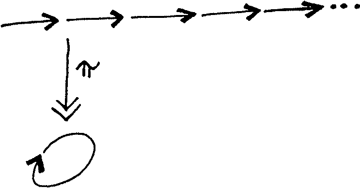

---

In the second alternative, the arrow points to its own body.

We have seen that this alternative can be extended to a notation for self-membership or reference of the body of the arrow to itself in the form in which an undercrossing points to (is a member of) the overcrossing line.

Self-pointing of an arrow or a line bifurcates into two interpretations depending upon whether the end of segment is seen as a pointer or whether an interior point of a segment is seen in relation to another interior point. In projection these two points of view come together through the convention of the cut segment at a crossing.

Any reference is a distinction. The notation adopted for a fundamental distinction has a remarkable influence on the way we think about it. In standard set theory a set is indicated by a pair of curly brackets: { } (This is the empty set.).

## A Story

The brackets themselves indicate bifurcation from a point.

---

Each bracket instantiates the growth of a distinction from a state of unity (the point of the cusp).

A further operation beyond bifurcation is necessary for the formation of a set. The bifurcation that is the (left) bracket is copied and mirrored to form the (right) bracket. A left and right bracket taken together become a container. Once we have reached the level of being able to make a distinction, and to make a copy of that distinction intrinsically distinct (the mirror imaging) from the original, then we are prepared to form a new distinction (the container). The new distinction occurs at a different level from the original distinctions. This allows the hierarchy that is set theory.

## Knot Structure

The self-pointing arrow is not a knot. The circle diagram for an unknot does not point to itself at all, but is simply a closed circular form. Examine the trefoil.

The diagram consists in three arrows, each one pointing to the body of the next.

The extra convention that the base of one arrow is always correlated with the tip of another is special to the knot theory.

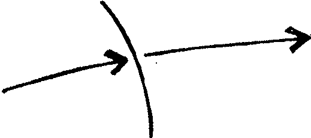

---

It allows the interpretation of the two arrows taken together as part of an undercrossing line, and hence the set theoretic and geometric interpretations that we have already discussed. If we contravene this convention, then we obtain diagrams such as the one below, where the base of an arrow simply begins from some point on an arc.

This gives us a set of planar diagrams that can be studied on their own terms. Self-pointing can take the form shown below.

The triplet structure of the trefoil is still present in diagrams such as this one.

One reason for considering such a wider class of diagrams it that it enables us to draw connections with the kind of diagrammatics that occurs in artistic, linguistic, physical and philosophical contexts. For example, the irreducible tripartite relation of sign, signifier and signified occurs in the work of Charles Sanders Pierce [PI] and is ubiquitous in semiotics and linguistics.

A symbol almost identical to the trefoil structure

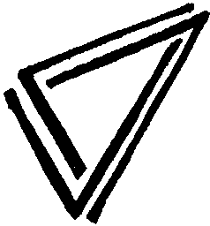

---

occurs in the stylized form shown above in the work of Annetta Pedretti [P] on language. Here the three parts represent the distinguishing subject, the that which is distinguished and the background binding the distinguished and the one who distinguishes.

A similar tripartite structure arises as soon as one includes the boundary in any distinction. Two sides and the boundary joining them form a tripartite structure where each part is determined by the other two parts. No boundary exists without the two sides. No side exists without the potential to cross the boundary from the other side. Frederick Joseph Staley [STA] calls such triplets triadic dualisms.

A triadic dualism need not have the appearance of either a trefoil or a distinction. The most striking topological example of a triadic relation is the link shown below. This link, the Borommean rings, is topologically linked, consisting of three unknotted circles. The rings fall apart upon the removal of any one of the triplet.

## V. Lambda Calculus and Topology

It is natural to enquire whether the knot sets shed light on the topological structure of knots and links themselves.

Consider a trefoil knot:

---

The set is just the self-membering $a=\{a,a,a\}$, and hence equivalent to the empty set in the radical theory and to one twist ($a=\{a\}$) in the regular theory (regular theory uses regular isotopy). Many topologically distinct diagrams correspond to a given knot set.

It is tempting to consider the possibility that the knots and links can be viewed in terms of a subtle kind of logic. This is in fact the case.

## Non-Associative Formalism in Knot Diagrams

Label the arcs in a link diagram. Regard the label on the arc c obtained by underpassing b from a as a product of a and b : $c=ab$.

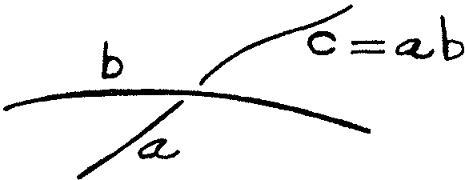

Here we abandon the notion of membership at a crossing and replace it with an algebraic product. Think of the overcrossing line as acting on the undercrossing line to produce the label for the continuation of the undercrossing. This is an inherently non-associative formalism, as the diagrams below demonstrate.

In this mode we can diagram the constructions of the lambda calculus of Church and Curry [B]. No direct knowledge of the lambda calculus is needed for the discussion to follow. However, the last part of this section is a discussion of the lambda calculus in relation to knots.

Consider $Gx = F(xx)$. If we substitute $G$ for $x$, we obtain $GG = F(GG)$. At this level of formalism, every $F$ has a fixed point $GG$ where $Gx = F(xx)$. Diagramming the nonassociative algebra inherent in this discussion we have:

---

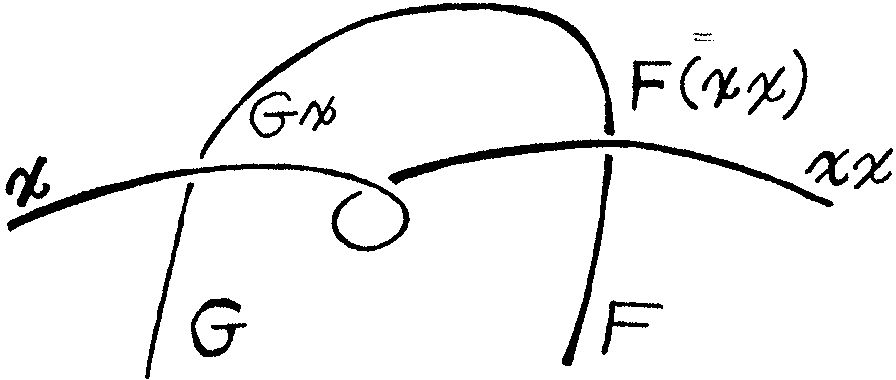

Taking $G=x$ in the above diagram, by tying together the lines, we obtain $GG = F(GG)$:

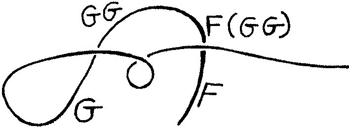

In this way, we obtain a knot diagrammatic interpretation of the basic fixed point construction of the lambda calculus. The analogy with our previous construction of self membering knot sets is striking, but these lambda calculus constructions use much more of the structure of the knot and link diagrams.

Here is a knot diagrammatic interpretation of the equation $Ya = a(Ya)$. It is a double leveled twist.

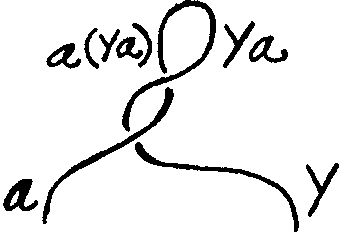

At this point we must take a more careful look at our conventions for handling diagrammatic non-associative products. If we take the convention for multiplication literally, then it can be read in two ways at a given crossing as shown below.

$$
\begin{array}{c} \frac{c}{ab} \\ \vert \\ a \end{array} \left\{ \begin{array}{l} c = ab \\ a = cb \end{array} \right\} \Rightarrow c = (cb)b.
$$

---

Thus $c=ab$ and $a=cb$. Hence $c = (cb)b$. For consistency, we demand that $c=(cb)b$ for all elements $b$ and $c$. Look at the diagrammatic consequences of taking the axiom $c = (cb)b$. We have the following diagram.

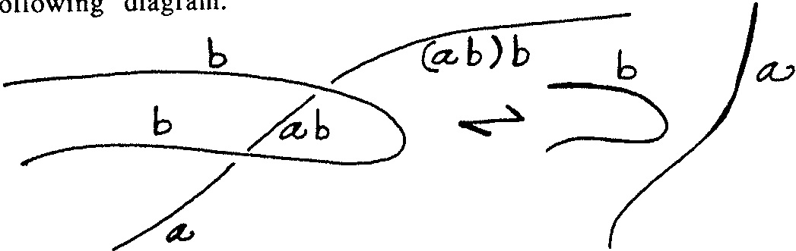

Under the axiom $c = (cb)b$, the algebra cannot see the second Reidemeister move. The demand for invariance under the third Reidemeister move leads to yet another axiom: $(ab)c = (ac)(bc)$. This states that the algebra is right-distributive over itself.

Finally for the type I move we need $aa=a$ for all $a$.

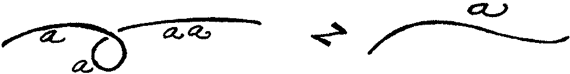

Thus we need an algebraic system with one binary operation and satisfying the axioms:

1. $aa = a$

2. $c = (cb)b$

3. $(ab)c = (ac)(bc)$

An algebra satisfying these axioms is called an *involuntary quandle* [J]. If we eliminate the first axiom it is called a *light crystal* [K2], [K6].

---

The simplest example of an involuntary quandle is as follows: Let R be a commutative ring, and define $a*b = 2b-a$. Then the operation * satisfies the axioms for an involuntary quandle. That is

1. $a*a = a$

2. $c = (c*b)*b$

3. $(a*b)*c = (a*c)*(b*c)$

The knot theory associated with this algebra is non-trivial. For example, label the edges of the trefoil knot with elements a,b,c as shown below:

We see that it is necessary that $a=b(ab)$ and $(ab)a=b$. In the specific representation we require that $a = b*(a*b) = 2(a*b) -b = 2(2b-a) - b = 3b - 2a$, whence $3(b-a) =0$. Similarly, $b=(a*b)*a = 2a - (2b-a) = 3a-2b$ and $3(b-a) =0$. This is satisfied in $R= \mathbb{Z}/3\mathbb{Z}$ ($\mathbb{Z}$ denotes the integers.) and so we can consistently label the knot from this involuntary quandle. The number 3 is a topological characteristic of the trefoil knot. The fact that this modulus is non-zero proves that the trefoil is in fact knotted.

By representing this fixed point ($a = b(ab), b= (ab)a$) into the structure of the involuntary quandle, we prove that the trefoil knot is in fact knotted. (Subtler methods are required to distinguish the trefoil from its mirror image.) These methods in fact show that the fixed point pair

$a=b(ab), b=(ab)a$

---

is non-trivial in the lambda calculus associated with the involuntary quandle axioms. Knot theory provides a rich domain for studying combinatory fixed points and their properties. The topology provides an expansion of the original context for lambda calculus. Insights from lambda calculus inform the theory of knots and links.

## Lambda Calculus

Lambda calculus is concerned with the formalism of composition of functions in an arbitrary non-associative algebra with one binary operation. The basic notation is illustrated by the forms $A= \lambda x.xx$, $B= \lambda xy. (xy)x$. The prefix on the form tells the variables that are free to accept substitution, and the order in which this substitution is to take place. Thus

$$
A= \lambda x.xx \quad \text{means} \quad Aq = qq \quad \text{and} \\ B= \lambda xy. (xy)x \quad \text{means} \quad (Bp)q = (pq)p.
$$

A completely left associated expression is written (by convention) without parentheses. Note that the variable that appears first in the list $(\lambda xy...)$ is the primary acceptor for substitution. Thus, given $C = \lambda xyz.F(x,y,z)$, and any other expression D, we can write $CD = \lambda yz.F(D,y,z)$ where in CD we have substituted D for every appearance of x in F, and we have removed x from the list of free variables in CD. This means that expressions in the lambda calculus have a well-defined binary law of composition. This composition is not associative. Note that the composition of expressions without free variables is just their formal juxtaposition in the free non-associative algebra (on one operation) generated by these expressions.

Consider $G = \lambda x.F(xx)$ where F is an element in the lambda calculus, and $xx$ denotes the composition of an expression with itself. Then $GG = F(GG)$ and hence the function $F(z)$ has a fixed point in the context of the lambda calculus. This is the well-known fixed point theorem for the untyped lambda calculus [B].

This fixed point is as mysterious as the set that is its own member. We have produced it without any use of infinity, and yet the substitution process does not stop inside F. We get the sequence

---

$GG = F(GG) = F(F(GG)) = \dots$

In this sense GG may be regarded as the creator of the limiting formal fixed point

$$
L = F(F(F(F(F...))))
$$

That is, by allowing infinite expressions we have the identity F(L) = L.

Note the striking difference between the application of G to itself and the application of G to any expression p. Gp = F(pp). If pp does not involve further substitutions then the process stops, while GG goes on forever. The key to this formation of recursion and fixed point lies in the duplication (pp) involved in the definition of G.

G is an operator on x that inserts x and duplicates it in the process of insertion. The application of a duplicating operator to itself results in an interior application of a copy of the duplicating operator to itself, and this process goes on forever. The pattern fits in a myriad of contexts. It is the basis of jokes, paradoxes, the theory of self-reproducing machines and even Gödel's incompleteness theorem. See section 8 of this paper for a discussion of these connections.

One can do ordinary logic in the lambda calculus by the simple expedient of identifying true (T) and false (F) with the following elementary lambda expressions: T = λxy.x, F = λxy.y.

$$
(Tx)y = x \\
(Fx)y=y
$$

It is then easy to see that

xyz = (xy)z means exactly "If x then y, else z".

(For example, let x=T. Then Tyz = (Ty)z = y. Thus Tyz is true if y is true and Tyz is false exactly when y is false. )

It is easy to define all the other logical operations in terms of the if-then-else. For example, let ~ a = aFT. Then ~ F = FFT = T and ~ T = TFT = F. Thus ~ a denotes the negation of a.

---

Now consider the following construction: $Qx = \sim (xx)$. Let $P = QQ$. Then $P = QQ = \sim (QQ) = \sim P$. Thus $P = \sim P$. $P$ is a paradoxical combinator, the direct consequence of the fixed point theorem in the domain of lambda calculus. The Russell paradox itself appears if we interpret $AB$ as "B is a member of A". Then $RX = \sim (XX)$ defines the set $R$ of all $X$ that are not members of themselves, and the substitution of $R$ for $X$ gives the paradoxical value: $RR = \sim (RR)$.

In terms of our conventions for non-associative algebra and link diagrams, the interpretation of $AB$ as $B \in A$ is backwards unless we work with the opposite algebra where $A$ represents an overcrossing line and $B$ and undercrossing line. Just for the rest of this section, lets do that. Thus, the operation $AB$ will be represented in link diagrams as shown below.

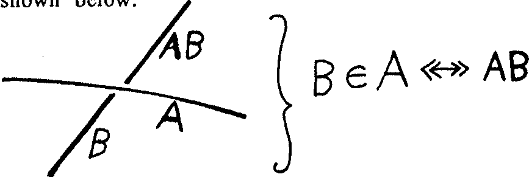

In this form we see that the non-associative algebraic interpretation of knot diagrammatic formalism is a generalization of knot set formalism where membership is indicated not by the full undercrossing line, but by one arc $B$ that approaches the overpass $A$. The outgoing line, labelled $AB$, expresses the relation $B \in A$.

Just so, the lambda calculus for sets (with $AB$ denoting $B$ as a member of $A$) involves generalized sets corresponding to the membership relations themselves. Thus $A(BC)$ says that "$C \in B$" is a member of $A$. While the entity "$C \in B$" is not defined as a collection, it is defined as a new arc in the diagrammatics. In this diagrammatic system, each arc stands for a statement of membership relative to the other arcs in the diagram. Self-membership is diagrammed via

---

and it is indicated by the exit line AA:

In this pictorial language, statements (such as A) and meta-statements (such as A ε A) are handled at the same level of the formalism.

Diagramming the Russell paradox we find:

The final circuit corresponding to RR = ~(RR) is balanced (labelled consistently) if there is a value for RR such that RR = ~(RR). Otherwise, it can be regarded as a runaway feedback system related to the recursion Xn+1 = ~Xn. For the input values T or F, the system oscillates between T and F. For an appropriate imaginary value for RR it is balanced.

Remark on Insertion and Reentry. The lambda calculus shares a structural component with the reentry notation of section 2. A lambda expression is equipped with pointers into itself. We devise a notation that makes these pointers explicit.

Let $\lambda x.F(x) = F(\textcircled{0})$ so that $F(\textcircled{0})$ a = F(a).

---

Similarly,

$F(\checkmark) a = F(aa).$

Thus, if

$G = F(\checkmark)$ then

$GG = F(\checkmark) \quad G = F(GG).$

In reentry notation, $GG = F(GG)$ is denoted by an arrow pointing into the place where the expression reenters its own indicational space:

$GG = F(\uparrow) \iff GG = F(GG)$

Thus

$F(\checkmark) F(\checkmark) = F(\uparrow)$

In this formalism the simplest instance of the fixed point theorem is the statement

$\checkmark \circled{=} \uparrow$

The notation is useful for the construction of specific fixed points.

**Lemma.** There is an expression Y in the lambda calculus such that for any $a$, $Ya = a(Ya)$. Thus $Ya$ is a fixed point for $a$.

**Proof1.**

$$
\begin{align*}
& Ya = a(Ya) \Rightarrow Ya = a\uparrow \\
\Rightarrow & Ya = a\circled{=}a\circled{=} \\
\Rightarrow & Y = \checkmark \circled{=} \circled{=} \\
\end{align*}
$$

---

Thus $Y = \lambda a.(\lambda x.a(xx))(\lambda x.a(xx)).$ //

Proof2.

Thus $Y = (\lambda xa.(a((xx)a))(\lambda xa.(a(xx)a)).$ //

The two solutions to the assertion in the Lemma are (in standard notation) due respectively to Church and to Turing. Without the reentry and insertion notations and their interrelationship expressed by the fixed point theorem, it would be hard to see that these two solutions express the very same process.

Dana Scott's Tower

For many years there was a question about the relative consistency of lambda calculus. This was particularly serious since the paradoxical combinators leap directly out of the mouth of the fixed point theorem. In [S] Dana Scott produced a model by using a "hierarchy of languages". <<Recall Bertrand Russell's comments in the introduction to Wittgenstein's Tractatus [WITT] about the possibility of an exit from the "Wovon man nicht sprechen kann, darüber muß man schweigen." through a hierarchy of languages.>> Scott's hierarchy is a tower construction in the form

$$
X_0 \subsetneq X_1 \subsetneq X_2 \subsetneq X_3 \subsetneq \dots \subsetneq X_\infty
$$

Each $X_n$ is a topological space with a weak (non-Hausdorff) topology and such that it contains the autohomeomorphisms of the previous level. There is a projection from each level to the previous level. The next higher level is produced by adjoining this projection. The

---

direct limit $X_\infty$ exists and is equal to its own set of autohomeomorphisms. Every point in the limit space is also a homeomorphism of that space. Enough properties are obtained so that $X_\infty$ becomes a model for the lambda calculus.

It is an interesting coincidence that a tower construction (due to Vaughan Jones [JO]) of great formal similarity to the Scott tower was the motivating force behind the discovery of the Jones polynomial in knot theory. Jones' construction creates a tower of von Neumann algebras and it is central to problems involving the classification of these algebras. It is worthwhile exploring the parallels between the Scott tower and the Jones tower. This will be the subject of another paper.

This ends our sketch of the lambda calculus.

VI. Interlock Algebra

It is the purpose of this section to explain how one further generalization of the methods of section 5 leads directly to the main considerations of classical knot theory and to the problems of the relationship of classical knot theory with the theory of quantum invariants of knots and links [See e.g. K6].

The generalization assumes that the knot or link diagram is oriented. An orientation consists in a choice of direction for each component - indicated by an arrow drawn on the component. With orientations indicated, we can define two binary operations corresponding to the two possible orientations at a crossing:

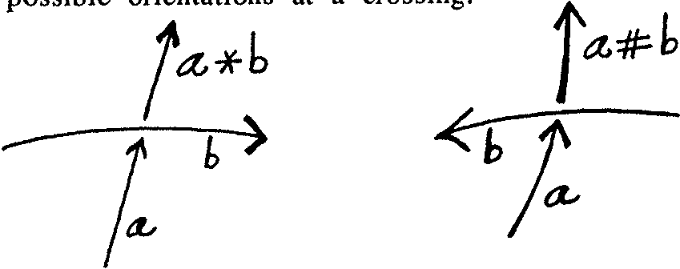

These operations are denoted by $a*b$ for the right handed crossing and $a\#b$ for the left handed crossing as illustrated above. Note that we in fact need only indicate the orientation of the overcrossing line and take the convention that if it goes to the right as one approaches

---

it along the under crossing line, then the operation is *, while if it goes to the left as one approaches it along the undercrossing line, then the operation is #. This means that we can once again take the reverse view of a given crossing and conclude that (a*b)#b = a and that (a#b)*b = a for all a and b. This means that the algebra is automatically invariant under the type two move.

Invariance under the type three move demands adding self distributivity for each of the operations. Thus we arrive at the axiomatic definition of a quandle [J]:

1. $a*a = a, a\#a=a$

2. $(a*b)\#b = a, (a\#b)*b = a$

3. $(a*b)*c = (a*c)*(b*c), (a\#b)\#c = (a\#c)\#(b\#c)$

A *crystal* is the algebraic structure that results from dropping the first axiom(See [K6].). (In [RF] a crystal written in exponential notation - *a*b = *a**b* is called a *rack*.) . The crystal is an invariant of framed links (see section 2). A quandle or crystal is associated to any oriented knot or link by taking the free (non- associative) algebra (in the sense of universal algebra) on the arcs of the diagram (one label for each arc) modulo one relation for each crossing as indicated above (c=a*b or c=a#b) and the axioms for the quandle, crystal or rack.

Regularly isotopic links have isomorphic crystals, and isotopic links have isomorphic quandles. The quandle completely classifies knots up to mirror images [J]. That is, if two oriented knots have isomorphic quandles, then they are either isotopic, or one is isotopic to the (orientation reversed) mirror image of the other.

The crystal can be used to completely classify knots, but at the cost of adding a subalgebra generated by special elements called longitudes. In keeping with our lambda formulation of these matters, a *longitude* L is a certain element in the form $\Lambda = \lambda x.xP_1P_2P_3...P_n$ where we use the convention that a product that is not explicitly associated is put in left associated form. Thus if $\Lambda = \lambda x.xABC$ then $\Lambda = \lambda x.((xA)B)C)$, whence $\Lambda x= (((xA)B)C)$.

---

Here $P_1, P_2, P_3, \dots, P_n$ are the operators (overcrossing lines) met in order as one traverses the knot diagram from some given point on the diagram. These operators are well defined up to cyclic order, and there are, accordingly, a set of n longitude operators corresponding to the cyclic permutations of the $P_i$'s. We add these longitude operators to the crystal, and take the algebra so generated, calling it the *interlock algebra* of the knot.

**Theorem.** *The interlock algebra is a complete classifier for the knot* in the following sense: Diagrams for two knots can be adjusted so that they both have writhe zero (The writhe is the sum of the signs of the crossings. See the example below.). If these diagrams have isomorphic interlock algebras, then the knots are isotopic in three dimensional space.

**Proof.** This follows directly from known theorems [Wald] about the classification of knots. The knot is completely classified by the fundamental group of the complement plus the peripheral subgroup generated by meridians and a standard longitude on the tubular neighborhood of the knot. This information can be read from the interlock algebra. By writing the interlock algebra as a lambda algebra, we are able to include the longitude in the algebra. //

Given a knot diagram $K$, let $I(K)$ denote its interlock algebra and let $\Lambda(K)$ denote the set of longitudes in $I(K)$. Note that the longitudes themselves are elements at a different level than the elements of the underlying crystal $C(K)$. Elements of the crystal have no free variables. Thus the algebra of longitudes and their compositions can be directly identified in any version of the interlock algebra. This is a case where combinatory logic impinges directly on topological applications.

**Example.** The writhe [K2] is the sum of the crossing signs

---

Thus the standard right-handed trefoil has writhe 3.

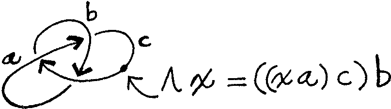

In this trefoil, the crystal is generated by a,b,c with the relations a*b=c, b*c=a, c*a=b. A representative longitude (starting at the segment labelled c) for the interlock algebra of this projection is $\Lambda=\lambda x.x^*a^*c^*b= \lambda x.((x^*a)^*c)^*b$.

A trefoil projection of writhe zero is shown below.

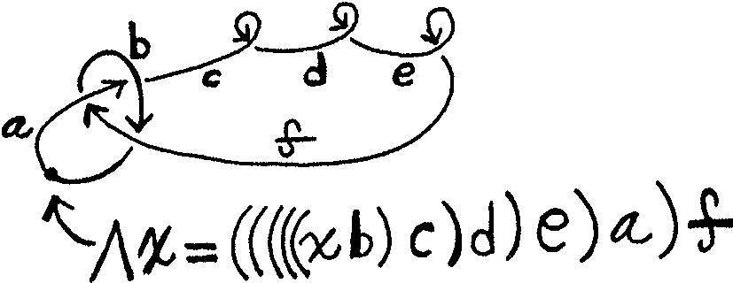

The crystal of this projection is generated by a,b,c with relations a*b=c, c#c=d,d#d=e,e#e=f,f*a=b,b*f=a. A representative longitude $\Lambda$ is defined by the operation $\Lambda x = x*b\#c\#d\#e*a*f$ (left associated). The interlock algebra contains complete information about the trefoil knot.

**Classical Knots.**

The fact that the interlock algebra is a complete classifier for knots follows from known results about the fundamental group and peripheral subgroup. It is an open problem to give a purely diagrammatic or knot logical proof of this theorem.

One illustration in relation to the Alexander polynomial is useful. Consider the trefoil knot indicated below.

---

$$
\chi = a(\chi a)
$$

In the crystal, we have the equation $a*(x*a) = x$, derived from this diagram.

The reader will easily prove that the definitions

$$
x*y = tx + (1-t)y
$$

$$
x\#y = (1/t)x + (1 - (1/t))y
$$

satisfy the crystal axioms. Here $x$, and $y$ belong to a module $M$ over the ring of Laurent polynomials in $t$.

The trefoil equation $a*(x*a) = x$ makes an extra demand on this module structure. In particular, the specific equation $a*(0*a) = 0$ becomes $(t^2-t+1)a=0$.

$$
\begin{aligned} 0 &= a*(0*a) \\ &= ta + (1-t)(t0 + (1-t)a) \\ &= ta + (1-t)^2a \\ &= (t^2-t+1)a. \end{aligned}
$$

It turns out that the polynomial $(t^2-t+1)$ is itself an invariant of the trefoil (up to multiplication by units in the ring of Laurent polynomials in $t$). This is the Alexander polynomial of the trefoil. Thus the Alexander polynomial is the annihilator of a module that is associated with the knot.

This completes our discussion of the relationship of the lambda calculus to classical knot theory and the theory of link diagrams.

## Operator Notation

Another notation is worth mentioning in this context. Rather than work in a non-associative algebra we can use an operator notation for $a*b$ as follows: Let $a*b = \overline{ab}$ and $a\#b = \overline{ab}$

We regard $a, \overline{b}$ and $\overline{b}$ as elements in a non-commutative algebra.

Thus

$$
(a*b)*c = \overline{ab}c
$$

while $a*(b*c) = \overline{abc}$.

---

A formalism of this type is equivalent to exponential notation (a*b = ab), but can be handled more systematically. Since in the crystal we have two operations a*b and a#b, two operator notations are also required.

Then inversion $(a*b)\#b = a$ becomes the equation $\overline{a b} | \overline{b} = a$. We can therefore regard $\overline{b}$ and $|b|$ as elements of a group of automorphisms of the underlying set $S$ of the crystal, and $b$ is the inverse of $b$. If we isolate this associated group structure $G$, then the longitudes of the interlock algebra find a natural home as special elements of $G$. With this viewpoint, we can eliminate the lambda notations and use the pair consisting of the crystal and special longitudinal elements in $G$ to form a knot classifier.

**Remark.** One way to handle the operator notation in ordinary typography is to write $A\{B\}$ for $A\overline{B}$. We will use this convention in the next section.

**Remark on Terminology**

Brieskorn [BR] called structures such as quandles, crystals and racks *automorphic sets*. The term quandle came first in David Joyce's 1979 thesis [J]. Crystals and racks mean essentially the same thing, and crystals first appeared in [K2],[K6]. Fenn and Rourke independently invented the concept and called it the rack in [RF]. Their concept includes new points of view about the homotopy and topology related to these structures.

# VII. The LD-Magma

We now turn to a remarkable application of the theory of braids to a problem in the borderline between universal algebra, set theory and logic. It is a problem that fits naturally into this discussion of knot logic. It is the problem of understanding a non-associative algebra with one binary operation that distributes over itself. In the notation of the previous sections we have seen that right-distributivity is an expression of the third Reidemeister move in the theory of knots. An equivalent convention will give similar pictures for left-distributivity, and we shall here discuss the structure of algebras that are *left-distributive*: $a*(b*c) = (a*b)*(a*c)$.

In [L] Laver raised the question of the word problem for *free left distributive algebras* (called *LD-magmas*). He solved the word

---

problem under the assumption of the existence of certain types of infinite cardinal numbers. Dehornoy [DH] discovered a direct solution to the word problem that was purely combinatorial. In the process Dehornoy showed how to embed an LD-magma into the Artin braid group and to thereby reduce the word problem to the topological and already-solved word problem for the braid group. In this section we discuss some of the properties of the LD-magma and how Dehornoy puts it inside the Artin braid group.

Here we work with a single binary operation $a*b$. Let $a*b = a\{b\}$ in operator notation as explained at the end of the last section. Let us assume left distributivity so that $a*(b*c) = (a*b)*(a*c)$. In operator notation,

$$
\begin{aligned}
a*(b*c) &= a\{b\{c\}\} \\
(a*b)*(a*c) &= a\{b\}\{a\{c\}\}
\end{aligned}
$$

Thus, for left distributivity, we assume the equation below

$$
a\{b\{c\}\} = a\{b\}\{a\{c\}\}
$$

for any a, b and c in the algebra. In order to get an intuition for this structure it is useful to do a few computations. We restrict ourselves to the case of the free algebra that is generated by one element a with left distributivity. Call this the *LD-Magma*. Let's begin by listing some elements of the magma:

$$
\begin{aligned}
& a \\
& a\{a\} \\
& a\{a\{a\}\}.
\end{aligned}
$$

The elements $a$ and $a\{a\}$ are not subject to the distributive law. But $a\{a\{a\}\}$ is subject to this law and it is in this way infinitely productive:

$$
\begin{aligned}
a\{a\{a\}\} \\
&= a\{a\}\{a\{a\}\} \\
&= a\{a\}\{a\}\{a\{a\}\{a\}\} \\
&= a\{a\}\{a\}\{a\{a\}\}\{a\{a\}\{a\}\{a\}\}
\end{aligned}
= \dots
$$

---

At the last stage shown we meet the possibility of distributing in two ways and enter a branching infinity of expressions derived from $a\{a\{a\}\}$. Note that all expressions in the LD-Magma are of the form $a\{A\}\{B\}\{C\}$... where A,B,C,... are themselves expressions in the Magma. The set of truncations of a given expression $a\{A\}\{B\}\{C\}$... are the expressions $a, a\{A\}, a\{A\}\{B\}, ...$. We shall say that X is less than Y (denoted $X < Y$) if X is a truncation of any expression that is equivalent to Y. Thus we have (by continuing the computation started above) that $a < a\{a\} < a\{a\}\{a\} < a\{a\}\{a\}\{a\} < ... < a\{a\\{a\}}$.

Dehornoy proves that, with this notion of inequality, the LD-Magma is a linearly ordered set. Given any two elements of the magma, either they are equal, or one is a truncation of an equivalent version of the other. There is great subtlety in this ordering.

Just to give the flavor of this enterprise, consider the elements $a^{[n]}$ defined inductively by

$$
a^{[1]} = a \quad \text{and} \quad a^{[n]} = a\{a^{[n]}\}.
$$

Thus $a^{[1]} = a$, $a^{[2]} = a\{a\}$, $a^{[3]} = a\{a\{a\}\}$, $a^{[4]} = a\{a\{a\}\}\{a\}$, ...

**Proposition.** Let P be any element of the LD-Magma. Then $P < a^{[n]}$ for some natural number n. In fact, for any P there is a natural number r such that $P\{a^{[n-1]}\} = a^{[n]}$ for all $n > r$.

**Proof.** We take the second sentence of the proposition as an inductive hypothesis, and proceed by mathematical induction. The simplest element of the magma is a, and we have $a\{a^{[n-1]}\} = a^{[n]}$ for all $n$ by the definition of $a^{[n]}$. Thus $r=1$ for the element a. This establishes the base for the induction argument. Now suppose that $R\{a^{[n-1]}\} = a^{[n]}$ for all $n > r$ and that $S\{a^{[m-1]}\} = a^{[m]}$ for all $m > s$. Let $n > r+s$. Let $P = R\{S\}$. Then

$$
\begin{aligned} P\{a^{[n]}\} &= R\{S\}\{a^{[n]}\} \\ &= R\{S\} \{R\{a^{[n-1]}\}\} \\ &= R\{S\{a^{[n-1]}\}\} \\ &= R\{a^{[n]}\} \\ &= a^{[n+1]}. \end{aligned}
$$

---

Since any expression in the magma can be built in the form $R\{S\}$, this completes the inductive step and hence the proof of the theorem.//

Dehornoy gives an inductive construction that embeds the LD-Magma into the Artin braid group. Equivalent expressions in the Magma go to topologically equivalent braids. In order to describe Dehornoy's construction, we must first recall the structure of the braid group. We regard the Artin braid group $B^\infty$ as the union of the braid groups $B_n$ on n strands where $B_n$ is embedded in $B_{n+1}$ by adding a trivial n+1st strand on the right.

Then $B_n$ is generated by the elementary braids $\sigma_1, \sigma_2, \dots, \sigma_{n-1}$ and their inverses where $\sigma_i$ is a braid where only the ith and i+1th strands cross as shown below.

In general, a braid in $B_n$ is a configuration of n strands in a plane crossed with the unit interval, so that the strands have a specific row of starting points in the top plane and a corresponding row of ending points in the bottom plane. Each planar cross section of the strands consists in n points. Thus each strand descends from the top plane to the bottom plane, possibly winding about its neighbors. $B_n$ becomes a group through the composition induced by attaching the bottom points of one braid to the top points of the other. The inverse of a braid is its mirror image obtained by reversing all the crossings in a planar projection of the braid. The group $B_n$ is generated by $\sigma_1, \sigma_2, \dots, \sigma_{n-1}$ and has a complete list of relations: $\sigma_i\sigma_{i+1}\sigma_i = \sigma_i+1\sigma_i\sigma_{i+1}$ and $\sigma_i\sigma_j = \sigma_j\sigma_i$ for $|i-j|>1$. The first relation is a version of the third Reidemeister move. The fact that $\sigma_i\sigma_i^{-1} = 1$ is an expression of the second Reidemeister move.

Dehornoy's construction takes elements of the magma into $B^\infty$. Let $X$ be an element of the magma and $b(X)$ its corresponding braid. Then $b(X)$ is defined inductively by the formulas

$$
b(a) = 1 \quad \text{and} \quad b(X\{Y\}) = b(X)s(b(Y))\sigma_1 s(b(X)^).
$$

---

Here $s(b)$ is the braid obtained from the braid $b$ by shifting all its strands to the right by one strand (add one straight strand to the left of $b$.) and $b(X)^n$ denotes the inverse of $b(X)$ in the braid group.

**Lemma.** $b(A*(B*C)) = b((A*B)*(A*C))$ where the equality on the right is equality of braids in the braid group.

**Proof.**

It is convenient to prove this result by checking that the corresponding operation on braids is left distributive. That is, we define on braids the operation $X*Y = X\{Y\} = Xs(Y)\sigma_1s(X)^\wedge$. We shall demonstrate that for braids A,B,C we have the equality in the braid group $A*(B*C) = (A*B)*(A*C)$.

$$
\begin{align*}
A*(B*C) \\
&= A\{B\{C\}\} \\
&= A \ s(B\{C\}) \ \sigma_1 \ s(A^\wedge) \\
&= A \ s(B \ s(C) \ \sigma_1 \ s(B^\wedge)) \ \sigma_1 \ s(A^\wedge) \\
&= A \ s(B) \ ss(C) \ \sigma_2 \ ss(B^\wedge) \ \sigma_1 \ s(A^\wedge)
\end{align*}
$$

$$
\begin{align*}
(A*B)*(A*C) \\
&= A\{B\}\{A\{C\}\} \\
&= A\{B\} \, s(A\{C\}) \sigma_1 \, s(A\{B\})^\wedge \\
&= A \, s(B) \, \sigma_1 \, s(A)^\wedge \, s(A \, s(C) \, \sigma_1 \, s(A)^\wedge) \, \sigma_1 \, s(A \, s(B) \, \sigma_1 \, s(A)^\wedge)^\wedge \\
&= A \, s(B) \, \sigma_1 \, s(A)^\wedge \, s(A) \, ss(C) \, \sigma_2 \, ss(A)^\wedge \, \sigma_1 \, [s(A) \, ss(B) \, \sigma_2 \, ss(A)^\wedge]^\wedge \\
&= A \, s(B) \, \sigma_1 \, s(A)^\wedge \, s(A) \, ss(C) \, \sigma_2 \, ss(A)^\wedge \, \sigma_1 \, ss(A) \, \sigma_2^{-1} \, ss(B)^\wedge \, s(A)^\wedge \\
&= A \, s(B) \, \sigma_1 \, ss(C) \, \sigma_2 \, ss(A)^\wedge \, \sigma_1 \, ss(A) \, \sigma_2^{-1} \, ss(B)^\wedge \, s(A)^\wedge \\
&= A \, s(B) \, \sigma_1 \, ss(C) \, \sigma_2 \, \sigma_1 \, \sigma_2^{-1} \, ss(B)^\wedge \, s(A)^\wedge \\
&= A \, s(B) \, ss(C) \, \sigma_1 \, \sigma_2 \, \sigma_1 \, \sigma_2^{-1} \, ss(B)^\wedge \, s(A)^\wedge \\
&= A \, s(B) \, ss(C) \, \sigma_2 \, \sigma_1 \, \sigma_2 \, \sigma_2^{-1} \, ss(B)^\wedge \, s(A)^\wedge \\
&= A \, s(B) \, ss(C) \, \sigma_2 \, ss(B)^\wedge \, \sigma_1 \, s(A)^\wedge \\
&= A*(B*C)
\end{align*}
$$

This completes the proof of the Lemma. //

See Figure 4 for a diagrammatic illustration of this proof.

Dehornoy proves that b: LD-Magma $----> B^\infty$ is injective. Thus the word problem in the magma is reduced to the already solved word problem in the braid group. He uses his results to prove that certain classes of braids are non-trivial, and raises the question of further interactions between this theory of magmas and the topology associated with the braid group.

---

In the spirit of this quest I suggest an investigation of the composition LD-Magma $\rightarrow\rightarrow\rightarrow B^\infty \rightarrow\rightarrow\rightarrow TL$ where TL denotes the Temperley Lieb algebra (See Remark 2 at the end of section 2.) with generators $1, U_1, U_2, U_3, \dots$ and relations

$$
U_i U_{i+1} U_i = U_i, \quad U_i U_{i-1} U_i = U_i, \quad U_i U_j = U_j U_i \text{ if } |i-j|>2, \quad (U_i)^2 = dU_i.
$$

Here TL is regarded with coefficients in $Z[A,A^{-1}]$ and $d=-A^2-A^{-2}$.

We then have the Jones representation [JO] $\rho:B^\infty \rightarrow\rightarrow\rightarrow TL$ of the braid group to the Temperley Lieb algebra given by the formulas $\rho(\sigma_i) = AU_i + A^{-1}$ and $\rho(\sigma_{i-1}) = A^{-1}U_i + A^{-1}$.

It is possible that the Jones representation is faithful. If this is so, then the composition $\rho b:LD-Magma \rightarrow\rightarrow\rightarrow TL$ is an embedding of the magma into the Temperley Lieb algebra.

Figure 4

---

VIII. On Gödel's Theorem, Self-Reproducing Machines, Knots and the Lambda Calculus

We point out the pattern that relates the fixed point theorem in lambda calculus to Gödel's Incompleteness Theorem, and to other issues about reference. Then we discuss mechanisms of replication, and even how to make knots reproduce themselves.

The pattern: Let G be defined by the equation $Gx = F(xx)$. Then, by substituting G for x, $GG = F(GG)$.

In one step, we have gone from finity to infinity, for GG demands to be substituted again and again in the form

$$
\begin{aligned}
GG &= F(GG) \\
   &= F(F(GG)) \\
   &= F(F(F(GG))) \\
   &= \dots
\end{aligned}
$$

In the limit, $J = F(F(F(F(...))))$ and $F(J) = J$.

The Building Machine

Suppose *B* is a *universal building machine*. Give *B* a description *x*; then *B* builds the machine *X* described by *x*. *B* sends along the description *x* with *X*:

$Bx ------> Xx.$

Let *b* be the description of the Building machine itself. Then

$Bb ------> Bb.$

This process will not stop. An endless cycle of self-reproduction ensues.

Gödel's Theorem, Indicative Shift, Quine and Knot

It is best to understand that $Gx=F(xx)$ means that $G$ is an entity that will create two copies of $x$ for any $x$ that it meets, and tuck these two copies inside the parentheses of $F$. In the Lambda Calculus of Church and Curry [B] one writes $G = \lambda x.F(xx)$. The lambda just indicates explicitly what variables are free for substitution and in *what order* the substitutions are to take place. With this notation in mind, let $\#X = XX$. We then have

---

$$
G = \lambda x.F(xx) = \lambda x.F(\#x)
$$

Whence

$$
\#G = GG = \lambda x.F(\#x)G = F(\#G).
$$

Now replace the equality sign by a sign of reference as we did in the case of the building machine. We obtain [K17]

The Indicative Shift: G ----> H then \#G ----> HG.

In this context the line above becomes the *definition* of \#G. \#G no longer connotes direct repetition of G, rather it connotes a new reference to G's referent and to G. As such \#G is a *symbolic description of the movement to a meta-level where sign and referent are together in one setting*.

Self-reference occurs when the meta-operator becomes a referent.

" I am the observed relation between myself and observing myself." [VF]

Let I ------> #, then substituting into the indicative shift, we have

G ----> H then \#G ----> HG. I ----> # then \#I ----> \#I.

The simplest case of this self-reference occurs when we take "#" to refer to #. Then "#" ----> # shifts to ""#" ----> ""#". This is a syntactic analogue of the famous Quine sentence: "Refers to itself when appended to its own quotation" refers to itself when appended to its own quotation.

A student at the School of the Art Institute of Chicago once remarked to the author of this paper that the trefoil knot was rather like the Quine sentence, if we regard "quoting" as "putting a loop around it".

---

Then the trefoil has the structure "A"A where A is a loop looping about itself.

Now return to original format, with a lambda expression:

$g \rightarrow \lambda x.NE(\#x) \quad \text{then} \quad \#g \rightarrow NE(\#g).$

The reference of g to $\lambda x.NE(\#x)$ is shifted into a reference of #g to NE(#g). The statement NE(#g) speaks about its own indicator, #g. This is the core of the logic of the Gödel Theorem on the incompleteness of formal systems. In that context, NE(Y) is the statement that there is no proof of the statement indicated by Y. Y is an integer. Every statement is indicated by a specific integer.

With g the indicator of $\lambda x.NE(\#x)$, #g is the indicator of NE(#g). NE(#g) asserts its own unprovability, and thereby becomes a theorem that cannot be proved within the system without an inconsistency. If the system is consistent, then the theorem NE(#g) is in fact true, and proved by a meta-argument outside the system. The meta-argument is precisely that NE(#g) cannot be proved within the system, coupled with its interpretation stating that NE(#g) asserts its own unprovability within the system.

*Can a knot deny its own detectability?* This is the curious speculation that emerges from the present line of thought. Such a Godelian knot would have to occur within the context of a given method of knot detection. In the case of the Alexander polynomial there are knots that avoid detection. For example, the Kinoshita-Terasaka knot shown below has Alexander polynomial equal to 1, the same value as the unknot, and it is indeed knotted.

---

Alexander cannot detect the K-T knot, even though his predecessor slew the Gordian Knot. Is the K-T knot a Godelian knot with respect to the Alexander polynomial? Does the structure of the K-T knot "say" that the Alexander polynomial is incapable of detecting it? We cannot answer this question with the present tools. It is tantalizing to imagine that the K-T knot encodes such a denial in its diagrammatic surface structure. If this could be understood, then it might be possible to generalize it and locate knots that are Godelian with respect to the Jones polynomial and other invariants. To this date, no one has found a knot that the Jones polynomial can not detect. Is there a knot that says

"I am (k)not detectable by the Jones polynomial"?

The Diagrammatics of Self-Reproduction

1. DNA

DNA self-rep [RZvL] (*self-rep* is short for self-reproduction) is based on the fact that DNA =WC, a joining of base-paired Watson (W) and Crick (C) strands. Here WC denotes the joined strands.

Let (WC)E ----> (WE) (CE) denote the process of strand separation (The Watson and Crick strands pull apart into two separate strands during mitosis.) in an appropriate environment E. The remaining abstract rules for this self-rep are:

WE ----> (WC)E and CE----> (WC)E. These rules are instantiated in the living medium, as free floating molecules attach themselves to the bare Watson or Crick strands. Thus the schema of DNA self-rep is as follows

DNA = (WC)E ----> (WE) (CE) ----> (WC)E (WC)E = DNA DNA.

---

## 2. The Building Machine (again)

Placed in this same format the Building Machine self-rep takes the form

$$
Bx \longrightarrow Bx Xx
$$

Here we have indicated a building machine that produces its work without destroying itself. Applied to its own description, the Machine appears to reproduce itself.

$$
Bb \longrightarrow Bb Bb.
$$

The scenario for the building machine is similar to the scenario for DNA, but conceptually quite different. DNA depends upon a form that can divide into complementary parts (W and C) that each rebuild their missing mate from the materials in the environment. The building machine follows arbitrary instructions to build "anything". Consequently, it can build itself. The formalisms reflect this conceptual difference. The DNA formalism accomplishes repetition through matching complementarities. The Building Machine formalism has repetition built into its structure.

## 3. Mighty Simple Self-Rep

Here is indeed a mighty simple set of formal rules for self-rep.

$$
C \longrightarrow A A
$$

$$
A \longrightarrow C
$$

The "cell" C splits apart into intermediate entities A and A. Each A becomes a copy of C.

$$
C \longrightarrow A A \longrightarrow C C.
$$

Of course one might wonder why we don't go directly for the *very simple* self-rep $C \longrightarrow C C$, repetition pure and simple. But after all, *Mighty Simple Self-Rep* has the advantage that it has a referent to an intermediate stage. Thus we can diagram *Mitosis* as a mighty simple self-rep:

A symbolic schema for this mitosis might be

---

We are thrown into the arena of arrow epistemology (See section 4 of the present essay). The entity C that self-replicates is a circularity, hence a self-pointing arrow. The arrow duplicates into two non-self-pointing arrows (C ----> A A), but arrows being what they are tend to curl up and become self-pointing (A ----> C). Cut a circularity, and it is no longer circular. Cutting the circularity is essential for its duplication. The intermediate stage is syntactically and semantically inevitable.

These structures for self-rep can also be seen as precursors for the topological complexities inherent in the self-rep for circularly closed DNA embedded in three-dimensional space. Here the individual strands are linked and a more complex environment (topological strand switching enzymes and more [SU]) is needed to navigate the appropriate intermediate stages. At this point the whole structure of knot theory comes to bear upon molecular biology.

## 4. A Knot-Logical Self-Rep

Here is a self-rep of a topological circle that is based upon letting go of part of the formal structure of knot diagrams. As we have discussed, the standard representation of a crossing involves breaking the undercrossing line into two local arcs at the crossing site. In the usual convention the end points of these arcs are paired across the boundary formed by the overcrossing line. It is as though the endpoints were magnetically attracted to one another so that if you move one of them, then the other one follows. Let us let loose of this convention. Let the arcs move independently of one another, but keep the convention that the endpoint of the arc must hug the overcrossing line. We then have

---

Call the equivalence relation generated by this slide together with the Reidemeister moves *slide equivalence* of knot and link diagrams. It is not hard to see that slide equivalence does away with most of the interesting topology, but it is quite fascinating to see *how* it does this. In particular, a single circle in the plane is slide equivalent to the disjoint union of *two* circles. This is our knot logical self-rep, as shown below.

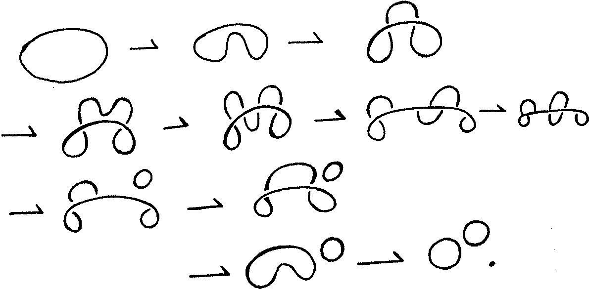

Notice how this process goes. First, by an ordinary Reidemeister move, the circle bifurcates into two arcs.

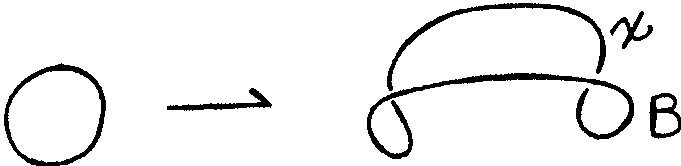

One arc stands as a platform for the other arc, so we shall label the platform B, and the arc standing upon it x. Then by another Reidemeister move we see that x can now triple into X (below the platform) and two copies of x.

---

Sliding rearrangements let us pair X and x to form a new circle, Xx, that disengages from the platform to form a separate circle C'. This leaves a single x on the platform, and a slide plus Reidemeister move reassembles this back to the original circle C. We have accomplished the self-rep C ----> C C'.

C ----> Bx

Bx ----> Bx Xx ----> Bx C'

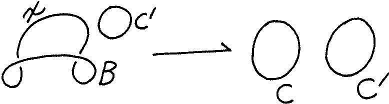

Bx C' ----> C C'

This self-reproduction via sliding is a way to make the formalism of the Building Machine into diagrams. It corresponds to the syntax of building machine formalism, but gives us a topological picture of this syntax. The mighty simple self-rep and the building machine self-rep are seen to be gremlins of the same clan.

End of Section on Self-Reproduction

---

**Remark on Slide Equivalence.** The slide equivalence used in knot logical self reproduction is actually a way to build any knot or link from the unknot. Any two knots or links are related by this equivalence relation. From the point of view of a topologist, this renders the equivalence relation trivial. From the point of view of biological analogy and epistemology it is intriguing to find a domain of forms just below the more rigid domain that holds the topology of knots and links. Slide equivalence is pre-topological (see the discussions of pre-geometry in sections 2 and 10). For the reader interested in how to build any knot or link by slide equivalence, we include here the appropriate sequence of Lemmas in diagrammatic form in Figure 5. For a related discussion, see [KH].

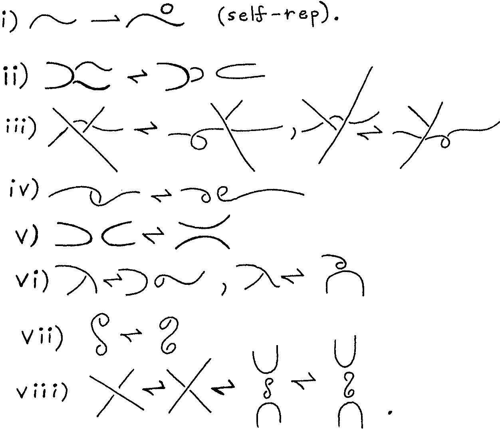

Figure 5

---

A modified version of slide equivalence is central to the study of three dimensional manifolds. Knots and links classify 3-manifolds when taken up to regular isotopy (see section 2) and the handle-sliding equivalence illustrated below together with creation and annihilation of singly framed circles. [KI]

In this context, the link diagram is a code for the construction of the associated 3-manifold via surgery. The surgery process is accomplished by regarding the three dimensional space that contains the knots as the boundary of a four dimensional ball. To this ball, a thickened disk (thickened to a family of disks parametrized by another disk) is attached along its boundary to each knot component in the diagram. Each such attachment is called a "handle". The boundary of the resulting 4-manifold is the 3-manifold obtained by surgery along the given link. The handle-siding move indicated above is exactly the result of sliding one of the four-dimensional handles over another so that at the end of the process the boundaries of both handles are in the original 3-dimensional space.

We can tell the story of the handle-sliding more slowly by moves on the links as shown below.

---

In the diagram shown above the handle on the left has just begun to slide up on the handle on the right. Part of the left diagram disappears into 4-space. The process continues, mediated by the rules

Thus

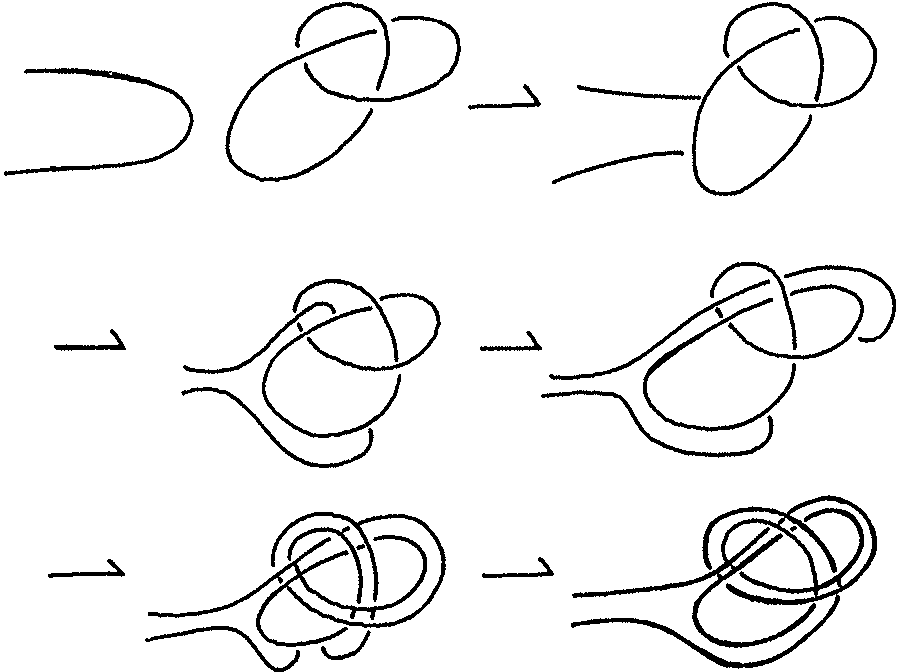

These local sliding rules resurrect the usual theory of handle sliding for link diagrams. It is understood, however, that free-wheeling recombinations of arcs are not allowed so that the self-rep is not part of this formal system. This modified version of slide equivalence for the study of 3-manifolds embodies a significant part of the relationship of knots with the theory of spin networks [K21], [K22], [K19] and will be discussed at greater length in another paper.

-78-

---

## IX. Quantum Knots and Topological Quantum Field Theory

Topological quantum field theory is a generalization of quantum mechanics. In quantum mechanics one computes amplitudes $<a|b>$ where $<a|$ denotes preparation and $|b>$ denotes detection.

In computing such an amplitude we cut the world via the distinction preparation/detection. It is the rules of quantum mechanical amplitudes that tell us how to combine networks of such cuts to form more complex amplitudes. These rules are utterly categorical, and they fit into topology in the following way: Imagine a topological space $M$, and a direction associated with that space that we can call "time". In this time direction there is an evolution of the slices of that space perpendicular to time. Thus the space is seen as a process that goes from vacuum to vacuum.

Let $<M>$ denote the vacuum to vacuum amplitude for this time evolution. Let us cut $M$ in two pieces $M'$ and $M''$ so that $M$ is the union of $M'$ and $M''$ along their common boundary $S$. Then we can think of $<M>$ as the amplitude $<M'|M''>$, and the two halves $<M'|$ and $|M''>$ become preparation and detection. In order for this to make physical sense it must be the case that the amplitude $<M>$ does not depend upon the way in which we cut $M$ into two pieces, and it must not depend upon the direction of time either. It is out of these very stringent conditions that one comes upon $<M>$ as a topological invariant of the space $M!$ In the process, the notion of bras ($<a|$), kets ($|b>$) and amplitudes $<a|b>$ has been generalized far beyond the confines of standard quantum mechanics.

The simplest case of bras and kets must be considered first. A bra $<a>$, is an element of a Hilbert space $H$. If everything is taken over the complex numbers $C$, then an element of $H$ can be regarded as a

---

mapping $C \dashrightarrow H$ (that is, the element itself is the image of the unit element 1). The ket, $|b>$, is an element of the dual space and hence it is a map $H \dashrightarrow C$.

The bracket is the composition $\langle a|b \rangle: C \dashrightarrow H \dashrightarrow C$, and the amplitude itself is the image of 1 under this composite. More complex spatial decompositions lead to more complex compositions, but the basic pattern is the same.

## The Logic of Dirac Brackets

This bracket notation of Dirac is subtle. If we write $P=|b\rangle\langle a|$ then the square of P is a multiple of P. This is embodied directly in the formalism:

$$
P^2 = PP = |b\rangle\langle a||b\rangle\langle a| = |b\rangle\langle a|b\rangle\langle a| = \langle a|b\rangle |b\rangle\langle a| = \delta P
$$

where $\delta = \langle a|b \rangle$. Note that we have implicitly adopted the notation $|| =|$ in order to indicate that the result of the composition of a bra with a ket is a scalar: $\langle a||b \rangle = \langle a|b \rangle$. The Boolean law of idempotency $(xx=x)$ underlies the structure of the Dirac bracket.

We can abstract the notation to the formal ket bra $Q=><$ with

$$
QQ = ><>< = <> >> = \delta >> = \delta Q
$$

where $<>=\delta$ is regarded as a scalar. Amplifying this notation slightly, we have

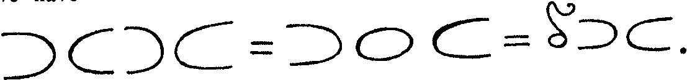

This is the simplest glyph in the diagrammatic interpretation of the Temperley Lieb algebra (See the remarks on the Temperley Lieb algebra and boundary logic at the end of section 2 of this essay.). Thus the Temperley Lieb algebra can be seen as a generalization of the formalism of Dirac brackets. In this way the brackets are directly related to topology.

---

## Recoupling

When the link diagrams are interpreted as toy models of particle interactions then it is natural to color the lines according to the particle states and to include trivalent interaction vertices that can be interpreted as the emission of a third particle under the interaction of the other two lines.

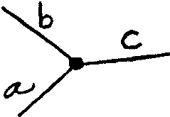

In the classical theory of quantum angular momentum there are many recoupling formulas such as

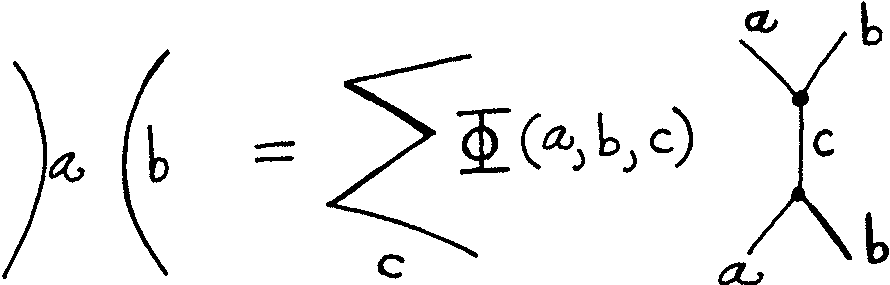

A formula like this matches the pattern of the handleslide as described at the end of the last section.

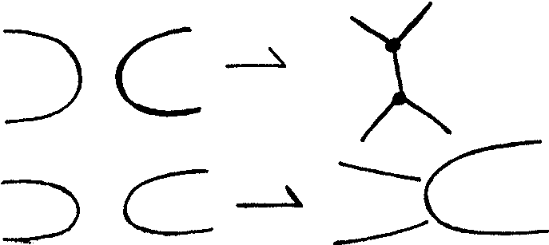

The marriage of these formalisms in the context of the Temperley Lieb algebra or the context of q-deformed spin networks results in invariants of 3-manifolds and in reconstruction of the invariants of Witten-Reshetikhin-Turaev in a combinatorial form [K19].

---

X. Knots and Circuits

It is perhaps not surprising that knots and electrical circuits should have some relationship with each other. However, it came as a distinct surprise [GK] to discover a way to get topological information about a knot by measuring the conductivity of an associated electrical circuit! This section will sketch this method and relate it to the context of logic and switching circuits.

Every knot or link diagram, K, implicates a planar graph, G(K), by the checkerboard construction illustrated below. In this construction, one shades the regions of the diagram, leaving the outer region unshaded. Each shaded region is then taken as a vertex of the graph. The edges correspond to crossings in common between pairs of regions (or between a region and itself for an edge that is a loop). Each edge is labelled with a plus sign (+) or a minus sign (-) according to the way the crossing is situated with respect to the edge. The sign is plus if turning the overcrossing line through the shaded regions is a counterclockwise turn. Otherwise, the edge is negative. This convention is illustrated below.

Given a planar graph with signed edges, we can construct a corresponding link diagram by the *medial construction*. The medial construction is inverse to the process that associates the graph G(K) to a link diagram K. Given G, we form the medial, M(G), as follows. First draw simple closed curves each describing the border of one of the regions of the planar graph G. Each curve is drawn just inside the region near the border actually described by the graph.

---

The result of this process will be that to each edge of G there are associated two parallel arcs from the curves drawn on either side of that edge in the plane. Insert in each such pair of arcs (one pair for each edge of G) a crossing of the type indicated by the sign of the edge. (When the edge has a positive label, turning the overcrossing line counter clockwise sweeps it across the edge.)

The reader can easily verify that

1. If K is a connected link diagram (i.e. the projected 4-valent graph in the plane associated with K is connected), then $M(G(K))=K$.

2. If H is a connected planar graph with signed edges, then $G(M(H))=H$.

(Equality in the first case is up to graphical isotopy of the link diagram in the plane. Graphical isotopy of the link diagram does not allow Reidemeister moves. It is just planar isotopy of the projected 4-valent graph that preserves the over and under crossing structure. Equality in the second case is graphical isotopy in the plane that preserves the signed edge structure of the graph.)

We conclude that there is a one-to-one correspondence between connected signed planar graphs and connected link diagrams in the plane.

Consequently, it is possible to translate knot theory to a theory about signed planar graphs. We now make this translation for the Reidemeister moves. *From now on we shall regard the edge labels + and - as the integers +1 and -1.* This convention is crucial to everything that follows.

---

The first Reidemeister move becomes the addition or removal of a pendant edge or loop in the signed graph:

The second Reidemeister move becomes the contraction of a series connection of plus and minus or the deletion of a parallel connection of a plus and minus.

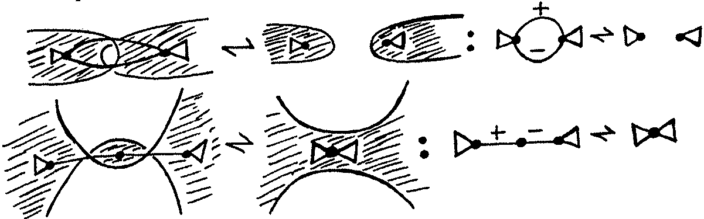

The third Reidemeister move is a replacement of a triangle by a star (or vice versa), with corresponding sign changes. In each of these local configurations there are two signs of one type and one sign of the opposite type. With the edges labelled a,b,c in the triangle and A,B,C in the star we have $X = -x$. (Edges in the triangle are matched with edges in the star so that a superposition of star and triangle has three distinct alphabetical labels at each vertex.)

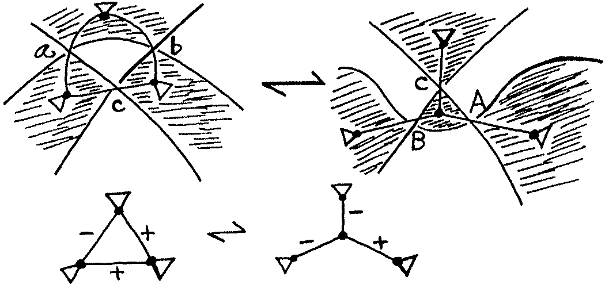

---

Just for practice, here is the reduction of a graph to a point (corresponding to an isotopy of a diagram that represents the unknot).

All of knot theory can be done in this category of graphs. In the original setting of the knot theory the Reidemeister moves have a definite topological meaning. One can wonder whether there is a natural interpretation of these moves for signed planar graphs. One answer to this question will emerge as soon as we recall a little elementary electrical theory.

## Recalling Electricity

It is most common to consider circuits composed of elements with different values of resistance. Two resistors connected in series have the sum of the resistances of the individuals. Two resistors connected in parallel have the reciprocal of the sum of the reciprocals of the individual resistors.

These rules follow from the relation $E=IR$ of voltage (E), current (I) and resistance (R) in conjunction with the Kirchhoff laws that the sum of the currents at a junction in a circuit is zero, and that the sum of the voltage drops around a closed loop is zero.

In the case of the series connection of resistances $R_1$ and $R_2$, we have a constant current $I$ in the wire and voltage drops $E_1$ and $E_2$ across $R_1$ and $R_2$ respectively. Thus $E_1=IR_1$, $E_2 = IR_2$ and $E=E_1 + E_2 = IR$ where $R$ is the resistance of the series connection of $R_1$ and $R_2$. Therefore, $IR_1 + IR_2 = IR$ and so $R_1 + R_2 = R$.

---

In the case of a parallel connection of resistances R₁ and R₂ we have currents I₁ in the R₁ branch and I₂ in the R₂ branch and a total current of I = I₁ + I₂ flowing out of the junction of the two branches.

The voltage drop across the parallel connection of the two branches being E, we have E = IR, I=I₁+I₂, E=I₁R₁, E=I₂R₂. Thus

$$
R=E/(I_1+I_2) = E/(E/R_1 + E/R_2) = 1/(1/R_1 + 1/R_2).
$$

Conductance is the reciprocal of resistance. Thus an open circuit has zero conductance and infinite resistance. A closed circuit with no resistance has infinite conductance. It is convenient in our context to work with conductance. Thus the parallel and series rules for conductance are

$$
a\{p\}b = a + b \\ a\{s\}b = a\#b = 1/((1/a) + (1/b)) = ab/(a+b)
$$

where {s} stands for a series connection and {p} stands for a parallel connection.

There is a *star-triangle relation* in electrical theory. For corresponding edges x and X from triangle a,b,c to star A,B,C the transformation is $X= S/x$ where $S=ab+ac+bc$. With these assignments of local conductance, stars and triangles can be interchanged in circuits that are otherwise identical without changing any global conductance calculation. (Edges in the triangle are matched with edges in the star so that a superposition of star and triangle has three distinct alphabetical labels at each vertex.)

---

$$
S = ab + ac + bc
$$

$$
A = S/a, \quad B = S/b, \quad C = S/c.
$$

The linear algebra in back of conductance leads to a global formula for the conductance of a circuit between two chosen points v and w (the input and output respectively). Let G be the underlying graph of the circuit. G is a graph with labels on its edges corresponding to the conductance of each edge. Let Σ(G) denote the sum over all maximal trees in G of the products of the labels on the edges of each tree. Let G(v,w) be the graph obtained from G by identifying v with w. Let C(G,v,w) denote the conductance of G from v to w. Then (See [GK].) we have the formula

$$
(*) \quad C(G,v,w) = \Sigma(G)/\Sigma(G(v,w)).
$$

For example, consider G as shown below. Then G has one tree and Σ(G) = ab. G(v,w) has two trees, and Σ((G(v,w)) = a + b. Thus C(G,v,w) = ab/(a+b). This corresponds to the rule for the conductance of a series connection.

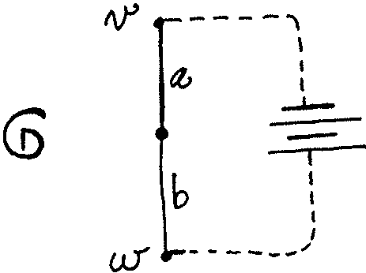

-87-

---

By using the formula (*), we can define conductivity for arbitrary algebraic labellings of graphs and the resulting theory will still be invariant under the series, parallel and star-triangle transformations. In particular, one can consider (formally) conductances that take negative or imaginary values. In such cases the quotient $Σ(G)/Σ(G(v,w))$ may take undefined values (0/0) when the denominator is zero. As long as the denominator is not zero, the transformations remain valid.

## Return to Knots

Since we can consider generalized conductances where the labels take negative values, it is now possible to return to the link diagrams, translated into graphs, and examine the relationship of the conductance with the performance of the Reidemeister moves. Using the graphical form we see at once from the previous discussion that each Reidemeister move is a transformation that leaves the conductance invariant. (It is assumed that the input and output terminals are not involved in the given Reidemeister move.) Therefore the conductance measures a topological property of the original link diagram and the Reidemeister moves have a (generalized) electrical interpretation.

For example, consider the Borommean rings as shown below. These rings are linked as a triple, but any two of them (in the absence of the third) are unlinked. We have drawn the corresponding graph, and see at once that the conductance will be non-zero for any two terminals since all the edges have weight +1. This means that we have proved that the Borommean rings cannot unlinked by any isotopy that does not pass the diagram over the points v and w.

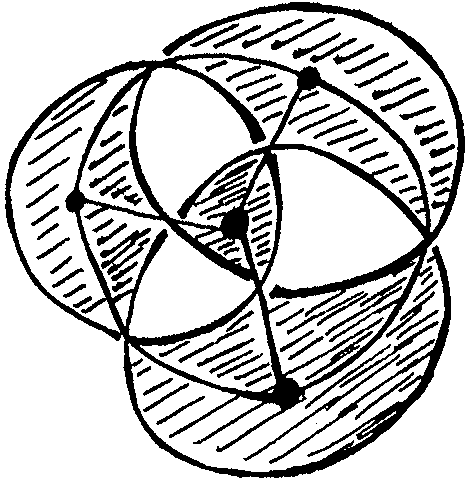

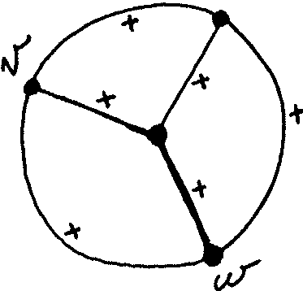

---

One way to put this is to imagine that two lines have been removed from 3-space. One line is perpendicular to the plane and runs through v, the other is perpendicular to the plane and runs through w. C(G,v,w) is an invariant of the link M(G) (equal the borommean rings in this case) as embedded in 3-space with these two lines removed. Call this space the *tunnel 3-space*, T[v,w].

It is easy to see that if you replace a link by its mirror image (by reversing all the crossings), then G is replaced by G* where all the edges change their signs. From this it follows that $C(G^*,v,w) = - C(G,v,w)$ whenever $C(G,v,w)$ is not equal to 0/1, 0/0 or 1/0 = $\infty$.

A nice application of this result ensues for alternating links. In an alternating link diagram a walker moving along one the strands of the link will alternately go over and under on successive crossings. A link is said to be alternating if it has an alternating diagram. Furthermore, the graph of an alternating diagram has all positive or all negative signs, just as in the case of the Borommean rings. Thus $C(G,v,w)$ is non-zero (determinate and not infinite) if $G=G(L)$ for L a connected alternating diagram. Therefore we have shown

**Theorem[GK].** For any choice of terminals (hence any choice of a pair of shaded regions) in a connected alternating diagram L, the corresponding embedding of L in the tunnel space T[v,w] is not ambient isotopic to its mirror image.

This result is interesting because many alternating knots and links are equivalent to their mirror images in ordinary 3-space. None of this achirality can prolong to the tunnel spaces associated with the diagram. For example, the figure eight knot shown below is equivalent to its mirror image, but it is not equivalent to its mirror image in the tunnel space shown below.

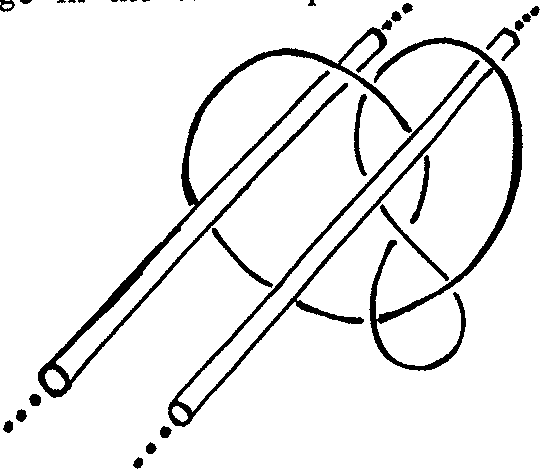

---

In [GK] we show how the conductance invariant can be expressed in terms of the Alexander-Conway polynomial in the special case where the terminals define a *tangle*. This case of tangles is of interest in its own right. We consider boxes with two inputs (top) and outputs (bottom) where the input and output lines are part of a weave or linkage inside the box. Equivalence of tangles is topological equivalence of these weaves restricted to motion inside the box that leaves the inputs and outputs fixed. It is natural to associate a shaded graph to a tangle as shown below.

With this association we have natural choices for input and output vertices of the graph corresponding to the input and output lines of the tangle. Therefore, we can directly define the conductance of a tangle, and it is equal to a conductance for the *numerator* of the tangle where the numerator is obtained by tying the two input lines together and the two output lines together as indicated below.

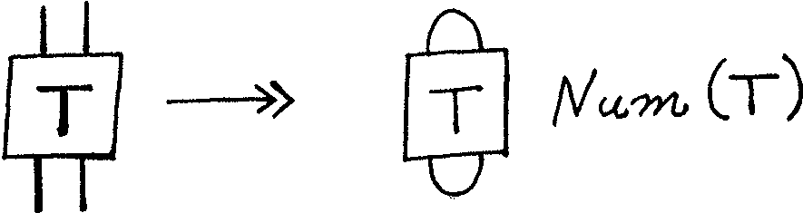

If we tie the inputs to the outputs as shown here, we get the *denominator* of the tangle. In the signed graph of the denominator of the tangle we see that the input and output vertices of the numerator have been identified with each other. Thus, by our definition of conductance, the conductance of the tangle is equal to the ratio of the tree sums for the numerator (graph) and the denominator (graph). Furthermore, the operations of series and

---

parallel combination for graphs become operations of addition and multiplication for tangles. See below.

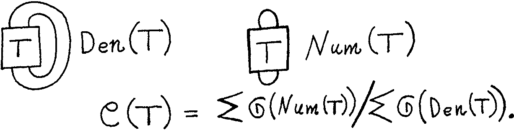

With these pictures, we can look again at the properties of conductance in terms of the calculus of tangles. The tangle corresponding to 0 is

The tangle corresponding to $\infty$ is

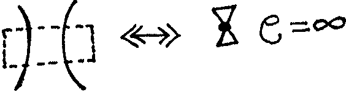

Series (#) and parallel (+) combination of circuits correspond to the following tangle operations - also denoted # and +. The operation # is called tangle multiplication and the operation + is called tangle addition.

The equations $1 + (-1) = 0$ and $1#(-1) = \infty$ correspond to the tangle deformations

The tangle calculus is quite useful because many classes of knots and links can be built from elementary tangle operations.

---

## From Electricity to Circuit Logic

We now turn to a relationship among elementary electricity, topology and switching logic. In studying the logic of switching circuits, one is concerned with networks of elementary switches. An elementary switch is a circuit element with one input lead, one output lead and two states. The states of a switch are *closed* and *open*. In the closed state the switch presents infinite conductivity. In the open state the switch presents zero conductivity. Thus we can represent the binary values for switching circuits by the values zero (0) and infinity ($\infty$). In this way we view switching circuits as special cases of circuits composed of conductances that vary between 0 and $\infty$, or as special cases of circuits composed of arbitrary conductance values.

A switch will be denoted as shown below, with a labelled arc to indicate that no state has been chosen. A solid arc indicates that the switch is closed and the absence of an arc indicates that the switch is open.

When we refer to a switching circuit we mean one with a designated input and a designated output line. Such circuits can be combined in series and in parallel. A given circuit may, however, not be obtained by series and parallel combination from elementary switches. For example, the switching circuit below is not so obtained.

Equality of switching circuits (A=B) means that they are both open or they are both closed. This makes sense if all the switches in a and all the switches in b have been set to specific states. We shall extend this notion of equality to circuits with labelled, but undetermined switches. Once a circuit has labelled switches it is possible for more than one switch to have the same label. The convention is that this is a *ganged* switch: All occurrences of a given label are either open or they are closed. Mechanical examples of switches that control a multiplicity of contacts are quite common. Now suppose that A and

---

B are switching circuits with switches labelled a,b,c,... . Call the set of labels $L(A\&B) = \{a,b,c,...\}$. Each label appears in A or in B or in both A and B. A state of A&B is a choice of values for the elements of $L(A\&B)$. For each state of A&B there is a specific choice of contacts in each circuit and hence each circuit is either open or it is closed. We say that $A=B$ if this equality is true for each state of A&B.

For example, if A and B are as shown below, then $A=B$. Note that the switch c in A is ganged. With c open both A and B are closed only if a and b are closed. With c closed, both A and B are closed.

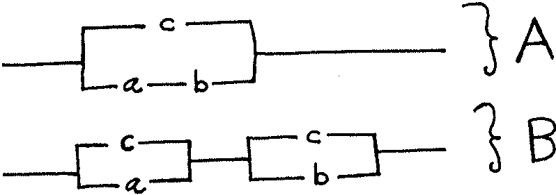

Let $a+b$ denote parallel combination of switching circuits

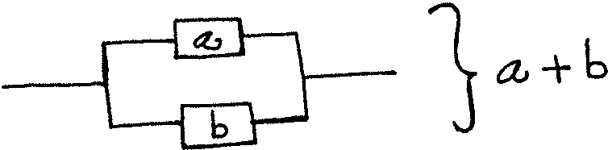

Note that $0+0=0$, $0+\infty=\infty=\infty+0$ and $\infty+\infty=\infty$.

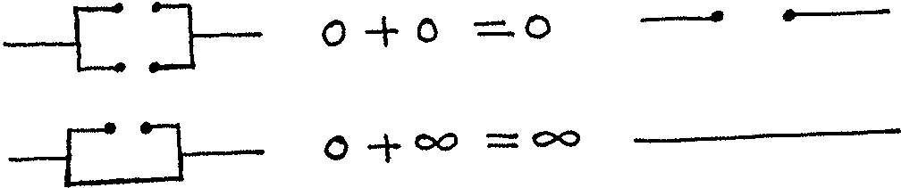

Let $a\#b$ denote series combination of switching circuits.

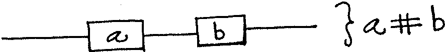

---

Note that $0\#0 = 0$, $0\#\infty = 0 = \infty\#0$ and $\infty\#\infty = \infty$.

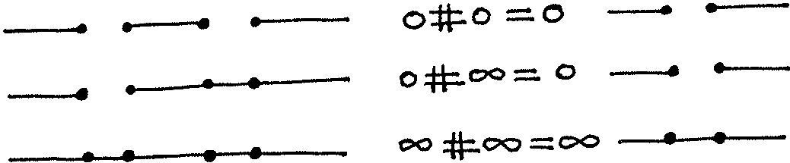

Since each switch has the two states (zero and infinity), we can define a unary operation, a $\rightarrow$ a', on switching circuits (with one input and one output designated) with $0' = \infty$ and $\infty' = 0$.

The definition is:

$a'$ is the circuit obtained by flipping all the switches in $a$.

It was Claude Shannon [SH] who observed that one input, one output switching circuits have the structure (as we have just described it) of a Boolean algebra. That is, Shannon observed that the operations $+$ and $\#$ are associative and commutative, that each distributes over the other: $a\#(b+c) = a\#b + a\#c$ and $a+(b\#c) = (a+b)\#(a+c)$. Furthermore, $(a+b)' = a' \# b'$, $a + a' = \infty$, $a\#a' = 0$, and $0+a = a$, $\infty+a=\infty$, $0\#a=0$, $\infty\#a=a$ for any circuits a and b. Here we have written the underlying two-valued Boolean arithmetic with the symbols 0 and $\infty$. The infinity symbol is usually denoted by the notation "1" in presentations of Boolean algebra.

Shannon also proved a star-triangle relation in switching theory. The Shannon relation is shown below.

---

This Boolean star-triangle relation is a direct consequence of the distributive law in Boolean algebra (Each of the operations + and # distributes over the other.). Thus $a\#b + c = (a+c)\#(b +c)$, and this equation corresponds to the network transformation shown below.

Note that the Boolean star-triangle relation is exactly the limiting case of the electrical one. One way to keep track of this is to use formal fractions involving $0$ and $\infty$ with $\infty = 1/0$ so that $0^{\infty} = 1$. Keep track of orders of zero and orders of infinity to the end of the calculation. In the example below, the triangle has labels $0,\infty,\infty$ and so by Boolean rules the star has labels

$$
0+\infty=\infty, \quad \infty+\infty=\infty \text{ and } \infty+0=\infty. \text{ Here } S = 0^{\infty} + \dots + \infty 0 = 2 + \dots + \infty 2.
$$

Thus in the limit calculation for electricity, the star is labelled with $S/0= S^{\infty} = 2^{\infty} + \infty^3 = \infty$ (final reduction of orders), $S/\infty = S0 = 2 \times 0 + \dots + \infty 0 = 0 + \infty = \infty$.

In this sense we see that the extended real numbers (including $\infty$ and $-\infty$) with operations $+$ (ordinary addition) and $\#$ ($a\#b = 1/((1/a) + (1/b)) = ab/(a+b)$) form a natural extension of Boolean algebra. Of course the Boolean rules no longer hold in this larger system. The operations $+$ and $\#$ fail to distribute over one another and the values $+1$ and $-1$ satisfy $x' = x$, paradoxical elements if restricted to a Boolean algebra. Note that it is exactly these paradoxical values that serve to label the two crossings in the knot theory.

---

Note that a universe (a link diagram with no indication of over or under crossings) can be regarded as a Boolean switching network in the plane. Each crossing is a switch with the two settings

In order to make input and output specific, lets take a flattened tangle T for our Boolean net. Once the switches are set, we get a state of our tangle, and its (Boolean) value is 0 if it is possible to walk between the input lines and end up at the output lines without crossing any arcs. Otherwise the value is ∞.

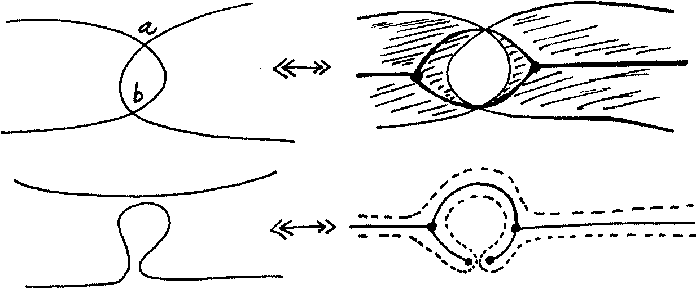

Let S be such a state for T. Let $||num(S)||$ denote the number of simple closed curves in the numerator of S, and let $||den(S)||$ denote the number of simple closed curves in the denominator of S. Let $D(S) = ||num(S)|| - ||den(S)||$. Then it is easy to see that S has Boolean value 0 if and only if $D(S) = 1$ and that S has Boolean value $\infty$ if and only if $D(S) = -1$. Thus we have (in our formal conventions for orders of 0 and infinity) the equation $VAL(S) = 0^{D(S)}$, where $VAL(S)$ is the Boolean value of the state S.

## From Circuit Logic to Electricity

This formulation for the Boolean case shows that the states of the knot theoretic switching net are in fact the states of the summation for the bracket polynomial [K2],[K3],[K4]. This suggests that the bracket polynomial at loop value zero may have something to do with conductance. This is correct, and gives the following formula in

---

the full case of tangles T with arbitrary over and undercrossings: Let $BR(K)$ denote the bracket polynomial for a link $K$ evaluated at $A = \sqrt{i}$ where $i^2 = -1$. (Note that the loop value is zero in this case.) Then the conductance of a tangle $T$ is given by the formula $C(T) = -i BR(num(T))/BR(den(T))$. This formula follows from the results in [GK].

Let $K^*$ be the mirror image of the link $K$ (obtained by reversing all the crossings of $T$). Then $BR(K^*) = BR(K)^*$ where $z^*$ denotes the complex conjugate of the complex number $z$. It follows directly from this formula that $C(T^*) = -C(T)$, a fact that we know directly from conductance calculations.

Since the bracket evaluation is based on the expansion formula $$BR(\mathcal{L}) = \sqrt{i} BR(\mathcal{L}) + (1/\sqrt{i})BR(\mathcal{C})$$ we see that the conductance of an arbitrary tangle is the ratio of weighted averages of Boolean evaluations for states of the switching network that underlie the tangle.

$[\text{In general } BR(\mathcal{L}) = ABR(\mathcal{L}) + A^{-1}BR(\mathcal{C}) \text{ with loop value equal to } -A^2-A^{-2}]$ defines an invariant of regular isotopy that is a version of the original Jones polynomial. See [JO], [K3], [K5], [K6].]

Abstract Tangle Calculus

We have just seen a natural evolution of definitions for the multiplication (#) and addition (+) of tangles. In the electrical theory the analogs of these operations ( series (#) and parallel (+) combination) satisfy the relation $a\#b = (a' + b')'$ where $x' = 1/x$. This leads to the question: Can we define an "inverse" operation on tangles $T \rightarrow T'$ such that for tangles $S$ and $T$ the equation $S\#T = (S' + T')'$ is a topological identity? The answer is that we can come very close.

The difference between the topology and the algebra is that topologically neither addition nor multiplication of tangles is commutative. Furthermore, the tangle obtained by turning a tangle upside down (exchanging inputs and outputs) is not necessarily the same as the original tangle. Lets define this operation by T $\rightarrow$ T^ and call T^ the *flip* of the tangle $T$. The flip of $T$ is obtained by turning $T$ around in the plane by 180 degrees.

---

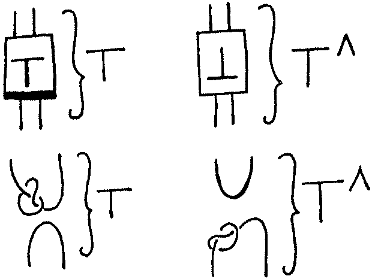

The diagrams above give an example of a tangle where T and T^ are topologically distinct. Note that we know that the conductance invariant cannot tell the difference between T and T^. That is, C(T) = C(T^) for any tangle T.

We now define the *inverse* T' of a tangle T by the formula T' = t(T*) where T* denotes the mirror image tangle obtained by reversing all the crossings of T, and t(T*) is the *twist* of T* obtained by making the left input the left output and the right output the right input, as shown below.

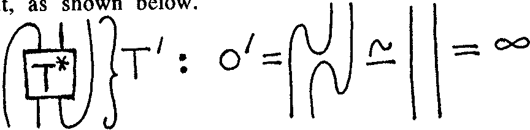

**Lemma.** For any tangles S and T, the following equation is valid topologically: $(S' + T')' = (S\#T)^\wedge$. Thus for any evaluation on tangles $T \dashrightarrow v(T)$ satisfying $v(A^\wedge) = v(A)$ and $v(A\#B) = v(B\#A)$ it follows that $v(S' + T')' = v(S\#T)$.

Proof.

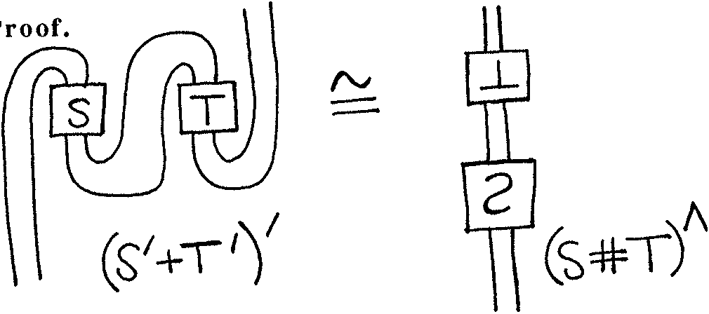

---

We may still wish to regard the sum of infinity and infinity as infinity rather than 0/0. This works if one is willing to take the different powers of zero into account ( as we did in the evaluation of a Boolean network). Formally, we take $0^{a_1}0^{b_1} = 0^{a_1+b_1}$ and $0^a + 0^b = 0^{\min(a,b)}$. This suggests working in a realm of formal fractions $[a, b]$ where $[a, b]+[c, d] = [ad+bc, bd]$ and powers of zero are handled according to the above rules.

In the tangle category, this brings us right back to the phenomenon that the powers of the zero tangle act like the Dirac bracket: Let $G$ denote this tangle. Identify $G$ with the formal fraction of $0/1$ : $G=[0,1]$. Then $G\#G = 0G$ where $0$ denotes a single loop and is taken to be the value zero in our conductance calculations. Since $G\#G = (G' + G')' = (\infty + \infty)^{-1} = [0,0,0]^{-1} = [0.0, 0] = 0[0, 1] = 0G$ this multiplicative phenomenon is identical to the matter of adding the infinity tangle to itself.

$$
\mathcal{G} = \bigcup_{n} , \quad \mathcal{G} \# \mathcal{G} = \bigcup_{n} , \quad (\mathcal{G}' + \mathcal{G}')' = \bigcap_{n} \mathcal{O} \cup \mathcal{O}'
$$

Now note the following algebra. Formally write aG+b where a and b are complex numbers and GG=0G.

$$
\text{Then } (aG+b)(cG+d) = (acGG + adG + bcG +bd) = (ad+bc)G + bd.
$$

Define $v(aG+b) = a/b$. Then we have that

$$
v((aG+b)(cG+d)) = (a/b) + (c/d) \text{ so that } v(XY) = v(X) + v(Y).
$$

Since $v(G) = v(G + 0) = 1/0$, we see that the rule $GG=0G$ corresponds directly to the formal addition $1/0 + 1/0 = 0/0$.

Multiplication of the forms aG+b corresponds to formal addition of fractions a/b and c/d. In this context it is natural to define the involution (aG+b)' = b*G + a* where z* denotes the complex conjugate of z.

This form of calculation corresponds to the bracket model for these tangles. In the bracket model, we can expand the tangle as a formal sum of tangles using the rules

$$
X = \sqrt{i} \bigcup_{n} \oplus \left( \frac{1}{\sqrt{i}} \right) \left( \right)
$$

---

Letting G denote the 0 tangle and 1 denote the $\infty$ tangle, we then have that any tangle S expands to a formal sum $S = aG + b$ for some complex numbers a and b.

The algebra of forms $aG+b$ can itself be regarded as a non-standard extension of the almost-Boolean logic of G and 1 with $GG=0G$. Here $G'=1$ and $1'=G$. In order to have $I=aG+a*$ and $J=a*G+a$ such that $IJ=1$ we require that

$1=IJ = (aG + a*)(a*G + a) = (a^2 + a^{*2})G + aa*.$ Hence $a* = a^{-1}$ and $0=a^2 + a^{-2}$. Thus we take $a = \sqrt{i}$. This corresponds exactly to the choice of bracket expansion that gives the conductance. I and J correspond to the two types of crossing. Here they are motivated by the desire to construct elements I and J in a quasi-Boolean algebra such that $I'=I, J'=J, J$ and $I$ are two views of an alternation $[a,b]$, and $IJ=1$. Compare this discussion with the description of the DeMorgan algebra at the end of section 2.

**Remark.** The requirement $IJ=1$ that makes all the difference. If we had asked that $IJ = 0$ we can achieve this end quite simply by taking $\{a,b\}$ with a and b Boolean values of 0 and 1, with $\{a,b\}' = \{b',a'\}$ and $G=\{0,0\}, 1=\{1,1\}, \{a,b\}+\{c,d\} = \{a+c,b+d\}, I=\{0,1\}, J=\{1,0\}$. This is the DeMorgan algebra mentioned in Remark 1 of section 2.

Thematically, asking for $IJ=1$ is to ask that the "waveforms" I and J interfere destructively. That the solutions to this go beyond a Boolean context is not surprising. That they are intimately involved in topology is remarkable.

## The Topological Deformation of Logic.

Finally, we must remark that having allowed $GG=0G$ for G an analogue of a dominant Boolean value, it is now a small step to try $GG=dG$ for d an arbitrary (possibly non-zero) constant. We try our (waveform) philosophy again: $I=aG+b, J=bG+a$.

We want the equation $IJ=1$.

Then $1 = (aG+b)(bG + a) = abGG + a^2G + b^2G + ab = (abd+a^2+b^2)G + ab$. Thus $b=a^{-1}$ and $d = -a^2 - a^{-2}$. Thus we arrive at the topological conditions for the bracket polynomial transposed into a quasi-Boolean domain. (The specific properties of tangle fraction addition are special to the value $d=0$.) The resulting logic is deformed with deformation parameter a. Its idempotency law carries a remembrance of multiplicities in the powers of $d=-a^2 - a^{-2}$.

---

XI. Logic and Circuit Design - Knot Automata

In using the interlock algebra, one regards the link diagram as a circuit whose parts (the arcs in the diagram) are both carriers of circuit values and operators that process these values. This duality is the core of the interrelationship with topology. In actual applications of digital circuitry, there is usually a sharp distinction between circuit elements as operators and circuit elements as carriers of signals. One exception to this is the phenomena of inductance and capacitance where the time dependent values in components of the circuit affect the way these components process the values. The close analogy of combinatorial knot theory with a combinatorial theory of digital circuits is worth pursuing even in the absence of inductance and capacitance. The purpose of this section is to outline such a theory of digital circuits for future reference and comparison with the knot theory.

In this section we consider a class of automata that are direct abstractions of digital circuitry. A real digital circuit instantiates this structure into hardware. The circuits that are described in this section are a well defined class of abstract automata. They are rich enough to build real computers, hence rich enough to construct universal Turing machines.

The basic digital element is an inverter, diagrammed as shown below.

Here we use two valued logic with values 0 and 1. We take 0'=1 and 1'=0, 00=0, 01=10=0, 11=1. This operation of juxtaposition (a,b ----> ab) can be interpreted as logical "or" for the interpretation of 0 as the value True. With more than one input the inverter becomes a NOR gate: a,b,c,... ----> (abc...'). Notation: Let <abc...> denote (abc...)'.

---

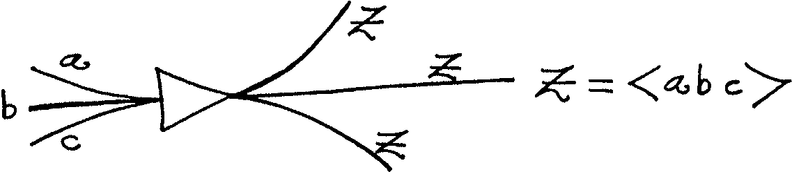

In this convention, the value 0 is dominant among inputs to the NOR gate, since $01=0$.

In a circuit diagram, a state is a coloring of the arcs that start from one inverter's output and terminate at another inverter's input. The colors are chosen from the set $\{0,1\}$. All arcs emanating from a given inverter are colored identically in a given state. (In this model an inverter has only one output value in any given state.) As a consequence of this stipulation we can write a single equation that describes the action of a given inverter in the circuit. Let $z$ denote the label for the outgoing lines of the inverter. Let $a,b,c,...$ denote the labels of its ingoing lines. Then $z=(abc...)'=<abc...>$ (see the notational remark above) is the equation describing the action of the inverter. In a given state these equations may not be satisfied at some places in the circuit.

A state is said to be balanced if the equation $z = <abc...>$ is satisfied at every inverter in the diagram. Here $z=<abc...>$ denotes the equation that defines the operation of the given inverter. Thus in the circuit below the balanced states are choices of values for $a$ and $b$ such that $b=<a>$ and $a=<b>$.

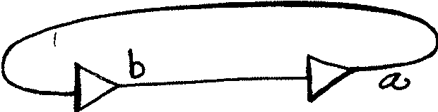

This circuit has exactly two balanced states: $a=0,b=1$ and $a=1,b=0$.

If $S$ is an unbalanced state of a circuit $C$, then there will be one or more equations of the form $z = <abc...>$ that are not satisfied by the coloring. A transition consists in reassigning the value of $z$ for the outgoing arcs $z$ of one inverter at which there is an imbalance. The new state achieved by the transition may or may not itself be balanced.

---

**Example1.** In the circuit below there are two possible transitions: $a=1,b=1 \rightarrow a=1,b=0$ and $a=1,b=1 \rightarrow a=0,b=1$. The states that result from this transition are both balanced. Call this circuit a *memory*. It has the equations $a=<b>$, $b=<a>$.

**Example2.** In the circuit below there is one possible transition $a=1 \rightarrow a=0$, but the resulting state is not balanced, and its transition $a=0 \rightarrow a=1$ returns the circuit to its original state. This circuit has the equation $z=<z>$, for which there are no Boolean solutions.

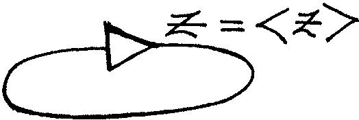

The circuit $z=<z>$ embodies the Liar paradox. If $z = 0$ then $z=1$. If $z=1$, then $z=0$. Its behaviour is an oscillation between 0 and 1.

*Circuit action* consists in a sequence of transitions from an (unbalanced) state of a given circuit. The action *terminates* when a balanced state is reached.

We are interested in designing circuits with given behaviours. The behaviour of a circuit consists in an appropriate summary of its circuit action - what balanced states it can achieve from a given set of unbalanced states that are relevant to the design problem. In this regard it is useful to say that a circuit action is *determinate* if it has only one possible end state independent of the possible sequences of transitions that may lead to this end state. Thus we can ask of a given unbalanced state whether the resulting circuit action is *determinate*. In the first example above the action is not

---

determinate. In the second example the action is determinate, but the set of possible balanced end-states is empty.

Example 3. This example, a modified memory, has equations a=\<bc>, b=\<a>, c=\<b>. Its only balanced state is a=1, b=0, c=1. If placed in any other state it transits to this balanced state. A sample transition is indicated below. This automaton is the abstract version of a machine that acts to turn itself off whenever it is turned on.

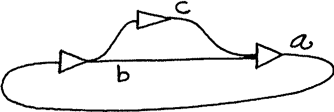

Example 4. Here is a memory circuit with inputs a and b to the two sides of the memory, labelled c and d. (An *input* is a lead that enters an inverter, but does not originate from an inverter in the given graph. An *output* is a lead that emanates from an inverter, but does not terminate at another inverter.) If we set a=0, b=1, c=1, d=1 then the circuit has a determinate transition to the end state a=0, b=1, c=0, c=1.

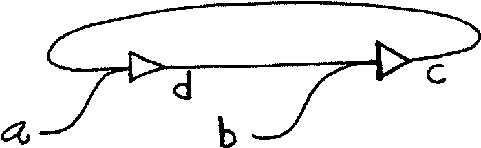

Note that input values do not change during a transition.

Example 5. The equations for this automaton, M, are

a=<biz> b=<ajz> c=<bd> d=<ac> i=<ad> j=<bc>.

---

Here we regard z as an input to the system. For each value of z there are two balanced states of M. If z=0, then V = (a,b,c,d,i,j) =A or C where A= (1,1,0,1,0,1) and C= (1,1,1,0, 1,0). If z=1, then V=B or D where and B= (1,0,1,0,1,1) and D=(0,1, 0,1, 1,1). One can then verify that for a given value of z and balanced state S, the transition that ensues upon changing z (from 0 to 1 or from 1 to zero) is determinate. The result is that the sequence of values z=0,1,0,1,0,1,... results in the sequence of states A,B,C,D,A,B,C,D, ... (Assuming that we start with z=0 in state A.).

As a model for action we assume that each change in z is held fixed long enough for the automaton to accomplish its transition to the next state. In terms of applications this means that the model assumes delays associated with each inverter. There are no delays associated with the connecting lines in the graph. This method of distributing the delays is a mathematical abstraction, but it is sufficiently realistic so that these circuits can actually work at the hardware level. In any given instantiation the delays are given up to the variation in the components. If the automaton is mathematically determinate (as in this example), then it will behave in the same way for any choice of actual delays- so long as the input varies more slowly than the time needed for internal balancing.

The circuit in this example converts an input oscillation z: 010101... to internal oscillations of twice the period. For example we have in the above state sequence d:100110011001100.... By taking d as an output, we therefore obtain a black box B with input line z and output line d with this behaviour. This is exactly the behaviour needed to make circuits that count in binary. A series connection of

---

n such black boxes produces an automaton that cycles through $2^{n+1}$ distinct states as the input $z$ oscillates between 0 and 1.

## Discussion.

Note the basic behaviour of our black box B. If $z$ changes from 0 to 1 then the output $d$ changes its value. If $z$ changes from 1 to 0, then the output $d$ does not change its value. Call a determinate automaton with this behaviour (or the corresponding behaviour with 0 and 1 interchanged, and also the possibility of starting with $z$ and $d$ the same value) a reductor.

Note that the number of leads in the automaton $M$ can be read from its equations by making a chart of the inverters (labelled a,b,c,d,i,j) to which each inverter or input is connected. For our automaton $M$ this chart takes the form

z:ab a:bdi b:acj c:dj d:ci i:a j:b

Here each line in the chart is of the form

R: list of inverters to which R is connected. where R is either an inverter or an input (z). The number of leads (14) is the number of letters occurring after the colons in this chart.

Thus we have a notion of the complexity of a reductor in terms of the number of inverters and the number of leads. We shall say that $M$ is of type (6,14), meaning that it has 6 inverters and 14 leads. Until recently I had thought that this design, which I discovered in 1978, was the reductor of minimal complexity. However, G. Spencer-Brown informed me in the Fall of 1992 that he has found a reductor of type (6,13) [SB-92]. It may be that (6,13) is the true minimum for this design. I conjecture this to be the case.

A more general conjecture is the following.

**Conjecture:** It is not possible to make a determinate (asynchronous) reductor with less than six inverters.

---

In this last conjecture, you are allowed to use as many leads as you please, but are requested to minimize the number of inverters.

The designs in common use such as the asynchronous JK flip-flop [GI] tend to use more inverters (NOR gates or NAND gates) and more leads. The least number of inverters in a published flip-flop design that I have encountered is nine. Nevertheless, it is the case that smaller working designs such as the reductor M are available, and could be used to save the number of transistors in the central processing units of digital computers by a factor of (2/3).

The most straightforward case for comparing the modes of thinking about circuit automata presented in this section with the knots discussed in the rest of the essay is to juxtapose the quandle description of a knot with the equational description of a circuit. Each structure is determined by a set of local equations that describes it interconnectedness and graphical structure. In the case of the topology of knots and links we have regarded the quandle equations as defining a possible coloring of the arcs in the knot diagram. This coloring is the analogue of a balanced state in a circuit automaton. In the topology we wanted to know that by perturbing the structure of the knot by a topological transformation (Reidemeister move) there was a natural balanced state for the new version of the knot corresponding to each balanced state of the old version. This led to an analysis of a very simple class of state transitions for the knot diagrams. In the circuit automata we do not change the structure of the network, but we do allow a great complexity of state transitions.

Knot Automata

Consider a class of circuit automata that are based on the theory of knots and links in three dimensional space. The basic circuit element for these automata has an equation of the form z = xRy or z=xLy with box depictions as shown below. Note the orientations on the lines.

---

Here R and L denote the two types of operations, depending upon left and right orientations in the plane. The circuit box for $z=xRy$ is a box with inputs y and x and outputs y and z. The box is regarded as passing without processing it, the value of y, while it transforms x to $z=xRy$ by some, as yet unspecified, rule. In this way, the action of the box is dependent upon the y value, but its action does not affect this value. It is part of the rules of the game, that the circuit diagram for such an automaton must be drawn in the plane, and that it must satisfy the following diagrammatic exchanges without affecting the balanced states of the automaton.

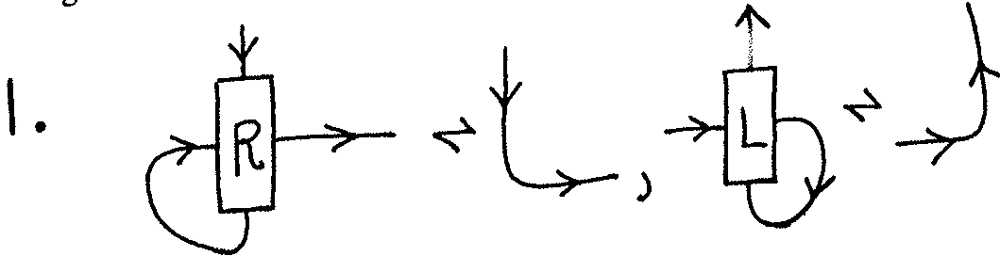

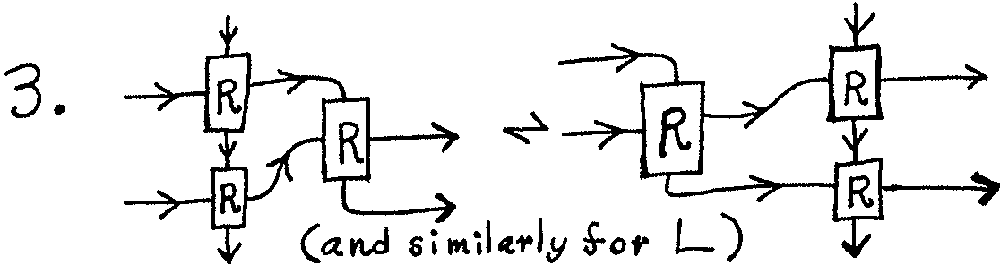

This means that if a given automaton has a balanced state, then all the automata obtained from it by transformations as shown will also have balanced states. By examining properties of the states of two given automata it is often possible to show that there is no sequence of transformations from one of them to the other due to differences in particularities of the states.

These structures have a topological interpretation because it is possible to associate a diagram for a knot or a link to each automaton, as shown below.

---

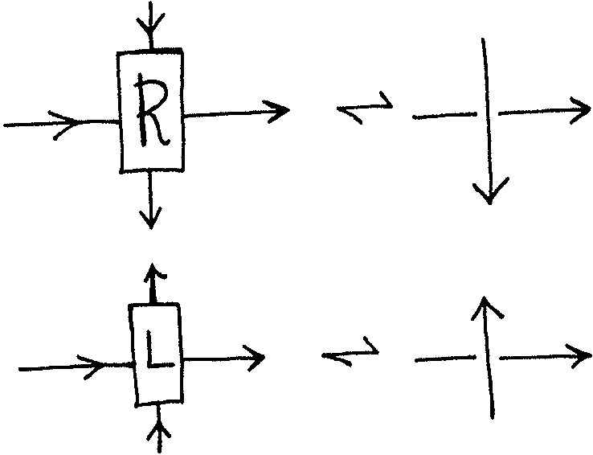

In this way the transformations that we have indicated become topological transformations of the diagrams, and these three types of transformation are known to generate all possible topological transformations of knots and links in three dimensional space (See the discussion of the Reidemeister moves in section 3.).

Returning to the automata, the three moves translate into the demands

$$
1. aRa = a, aLa = a
$$

$$
2. (aRb)Lb = a, (aLb)Rb = a
$$

$$
3. (aRb)Rc = (aRc)R(bRc), (aLb)Lc = (aLc)L(bLc)
$$

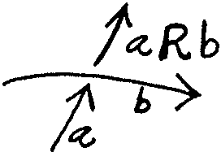

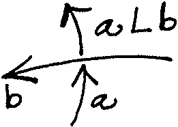

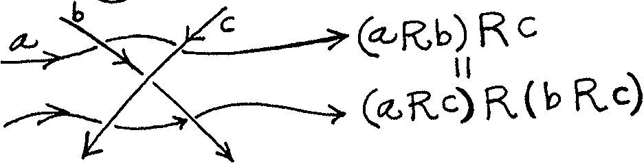

---

The second and the third are the most significant demands, asking that the operations R and L are invertible and inverses of each other for any b, and that the operations R and L are self-distributive. The resulting algebraic structure is a quandle (See [J],[BR],[DH].)

For our purposes, the simplest example of a quandle is the structure $aRb=aLb = 2b-a$ where a and b are elements of an additive abelian group. Thus the knottedness of the trefoil can be seen to be a consequence of using a three valued logic in the signals of an automaton associated with the diagram of the knot.

It remains to be seen how the transition behaviour of these automata is related to the topology.

## XII. Pregeometry

John Wheeler coined the term pregeometry in relation to foundations of physics.

"Among all the principles that one can name out of the world of science, it is difficult to think of one more compelling than simplicity; and among all the simplicities of dynamics and life and movement none is starker than the binary choice yes-no or true-false. It in no way proves that this choice for a starting principle is correct, but at least it gives one some comfort in the choice that Pauli's "nonclassical two-valuedness " or "spin" so dominates the world of particle physics."

"It is one thing to have a start, a tentative construction of pregeometry: but how does one go on? .... One suddenly realizes that a machinery for the combination of yes-no or true-false elements does not have to be invented. It already exists. What else can pregeometry be, one asks oneself, than the calculus of propositions"" ( [MTW] pp. 1208-1209.)

The diagrammatics of knots and links forms a natural domain for such a pre-geometric calculus of propositions. Links and their diagrams encode three dimensional manifolds. In this form a link is precisely a pregeometry. It is a distillation of the topological structure of a three dimensional manifold.

---

Knots and links form a calculus that is inherently self-referential and mutual. It is a pregeometry whose networks describe spaces and contain instructions for building these spaces. The knot and link diagrams are an intermediary domain between the realm of logical form and the geometry and topology of the perceived world.

In order to begin to understand how the diagrammatic languages for knots and links can be interpreted as pre-geometry, we must stand before these pictures with a new mind. These pictures, so redolent of images from familiar 3-dimensional space, are actually of another character entirely. They are traces of elementary action - the stroke of a hand, the movement of a brush. They are beginnings that fall back into void. They cohere through rules we provided for them, and fall apart when we change these rules. They are a mirror of language. They are the basis of language. In the multiplicity of mathematical interpretations for these diagrams, we have traversed wide territory. Yet there are other realms prior to geometry, prior to logic, more akin to the emotions and the brush stroke of the artist. These too are in the diagrams, and the world is every bit as much constructed from such ground as the ground of reason. It is necessary to start again and begin to draw a line ...

Pregeometry arose in the beginnings of things. In these beginnings, structures are unified because the distinctions that we use to tell them apart are not present. There seem to be hints of greater unifications at these points of beginning. It is here that one can start over again. In this sense, all the movements from nothing- from scientific descriptions of the creation of the universe to a writer's gropings before a blank sheet of paper- are all parts of the domain of pregeometry.

In this essay knots have been a touchstone in reconstructing logical ideas in a fusion with topology, recursion and quantum mechanics. Our attitude towards knots as pregeometry has been that of the mathematician standing before a clean blackboard and finding out what wants to be constructed. The idea of pregeometry arose in looking for a unification of gravity and relativity. Can knots be useful in that quest? Remarkably, there is a strong case for just that in the Ashtekar-Smolin-Rovelli theory of quantum gravity

---

[Ash92],[ASH],[PUL],[SM],[SM88]. In that theory, knots take a fundamental role through the topology and geometry of the loop transform.

## Quantum Gravity - The Loop Transform

We now discuss briefly the relationship of the Wilson loop $<K|A>$ and quantum gravity as forged in the theory of Ashtekar, Rovelli and Smolin. In this theory the metric is expressed in terms of a spin connection A, and quantization involves considering wavefunctions $\Psi(A)$. Smolin and Rovelli analyze the loop transform

$$ \Psi^K(K) = \int dA \Psi(A) \langle K|A \rangle \text{ where } \langle K|A \rangle \text{ denotes the Wilson loop for the knot or singular embedding K. Differential operators on the wavefunction can be referred, via integration by parts, to corresponding statements about the Wilson loop. It turns out that the condition that } \Psi^K(K) \text{ be a knot invariant is equivalent to the so-called diffeomorphism constraint for these wave functions. In this way, knots and weaves and their topological invariants become a language for representing the states of quantum gravity. This effects a transformation between field theoretic and differential geometric formulations of gravity with formulations based upon functionals on loops in three dimensional space.} $$

The key to this transition from classical gravity to quantum gravity is the movement to functions on arbitrary loops in space. In the classical mode, the Wilson loop around a very tiny loop about a point measures the curvature of the gauge field at that point. In this theory the Wilson loop around arbitrary loops contains extra information that is quantum mechanical. The constraints on the quantum theory demand that the loop functionals be topological invariants. This means that the question of size of a loop must disappear. This quantum theory does not discriminate between the macroscopic and the microscopic. In fact, it regards the entire three dimensional spatial universe as the analogue of a single particle. Size returns in the form of a mesh of measurements by loop or weave that fills the space. For a given classical metric there is an optimal weave ([ASH92], [SM88]) whose loops best approximate this metric. This means that the metrics on the space can be replaced (up to approximation) by weaves that fill the space. In this sense this theory takes to heart the old metaphors associated with the "fabric of spacetime".

---

Insertion, Lambda Calculus and Pregeometry

The Wilson line is the limit, over partitions of the loop K, of products of the matrices (1 + A(x)) where x runs over the partition. Thus one can write symbolically,

$$
\langle K|A \rangle = \pi_{\text{xeK}}(1 + A(x)) = \pi_{\text{xeK}}(1 + A^a_k(x)T_{\text{adx}}^k).
$$

It is understood that a product of matrices around a closed loop connotes the trace of the product. The ordering is forced by the one dimensional nature of the loop. Insertion of a given matrix into this product at a point on the loop is then a well-defined concept. If T is a given matrix then it is understood that $\langle K|A \rangle T$ denotes the insertion of T into some point of the loop.

From the point of view of the discussions in this paper of lambda calculus in relation to knots, it is apparent that the *Wilson line* provides the knot with the structure of a lambda operator. In fact, within the confines of the conventions we have indicated for insertion, the notation could be prolonged to write $\lambda xyz. \langle K|A \rangle$ to indicate that insertions were to be performed at the positions x, y and z successively along the knot.

Our remarks imply the following formula for the variation of the Wilson loop with respect to the gauge field:

$$
\delta\langle K|A \rangle / \delta(A^a_k(x)) = \lambda x. \langle K|A \rangle T_{\text{adx}}^k.
$$

Varying the Wilson loop with respect to the gauge field results in the insertion of an infinitesimal Lie algebra element into the loop.

Proof.

$$
\begin{align*} \delta\langle K|A \rangle / \delta(A^a_k(x)) &= \delta\pi_{\text{yeK}}(1 + A^a_k(y)T_{\text{ady}}^k) / \delta(A^a_k(x)) \\ &= [\pi y \langle x(1+A^a_k(y)T_{\text{ady}}^k) \rangle] [T_{\text{adx}}^k] [\pi y \langle x(1+A^a_k(y)T_{\text{ady}}^k) \rangle] \\ &= \lambda x. \langle K|A \rangle T_{\text{adx}}^k. \quad \text{QED.} \end{align*}
$$

In practice, one tends to use this operator structure informally, with points of insertion indicated by the context. Nevertheless the lambda structure is crucial to the use of the loop transform.

---

For example we now work out the transform of the operator $\Delta=\delta/\delta(A^a_k(x)):$

$$
\begin{align*}
(\Delta\Psi)^{(K)} &= \int dA (\Delta\Psi(A)) \langle K|A \rangle \\
&= \int dA \left(\frac{\delta\Psi(A)}{\delta(A^a_k(x))}\right) \langle K|A \rangle \\
&= - \int dA \Psi(A) \left(\frac{\delta\langle K|A \rangle}{\delta(A^a_k(x))}\right) \\
& \qquad \text{(integration by parts)} \\
(\Delta\Psi)^{(K)} &= - \int dA \Psi(A) \lambda x. \langle K|A \rangle T_a dx^k.
\end{align*}
$$

This example shows clearly how the loop transform takes differential operators on the wave functions Ψ(A) and translates them into operations on Wilson loops that can be expressed in terms of this version of lambda calculus.

The knots form an underlying calculus of propositions for the states in the Ashtekar-Smolin-Rovelli theory of quantum gravity. They are indeed a calculus of propositions forming pregeometry.

Coda on Reentry.

Having pointed to knots and links as a form of pregeometry, it is necessary to ask whether this is too restrictive a point of view. It may be more appropriate to say that the domain of recursive forms and self-reference is the actual resting place of pregeometry, and that knots are a special case of this phenomena that interrelate directly with the structure of three dimensional space. In order to leave the reader with an example to ponder for this question, here is a sequence of reentry forms that we shall label S0, S1, S2, S3, ... .

---

It is easy to see that the number of divisions of $S_n$ at depth k, denoted $S_{n,k}$ is given by the formula $S_{n+1,k+1} = S_{n,k} + S_{n,k-1}$. From this it follows that $S_{n,k+1}$ is the number of divisions of Euclidean n-space by k hyperplanes in general position. The forms $S_n$ are the representatives of the pregeometry of the Euclidean spaces. In particular, a point (dimension zero) is represented by an elementary self-reference.

By the same token, every knot is a labelling of the Fibonacci tree [K2, Chapter 6] represented by the reentry shown below.

Deeper understanding of space, topology, geometry and physics is hidden in the properties of these recursive forms.

---

## Appendix: The Bracket Polynomial

This appendix describes the construction and basic properties of the bracket polynomial [K3],[K4],[K6]. We have referred to the bracket in a number of places in this essay. The bracket polynomial is probably the simplest entry point into the study of invariants of knots and links. This invariant provides a model for the original Jones polynomial. The bracket formulation is related to models in statistical mechanics and to the Temperley Lieb algebra.

The idea is to first set up a well-defined recursive polynomial calculation on unoriented link diagrams. The calculation will depend upon three polynomial variables and we then investigate what specialization of these variables can yield invariance under the Reidemeister moves.

The recursion is based on the following idea: Given a link diagram and a crossing in that diagram, there are two ways to smooth the crossing to eliminate the crossing. See the diagram below.

We take the defining equation for the bracket calculation to be

$$
\langle \mathcal{X} \rangle = A \langle \mathcal{X} \rangle + B \langle \mathcal{C} \rangle
$$

where the small diagrams indicate parts of larger diagrams that are identical except at the site of the crossing and its two smoothings.

Here A and B are commuting algebraic variables. Repeated performance of this calculation eventually eliminates all the crossings and demands an evaluation of collections of disjoint simple closed curves in the plane. We take the evaluation of such a collection S to be $d||S||$ where d is a new algebraic variable commuting with A and B and $||S||$ is one less than the number of simple closed curves in the collection S. We can summarize this rule by the equations $\langle O K \rangle = d \langle K \rangle$, and $\langle O \rangle = 1$. The first equation states that an extra curve in the link diagram multiplies the bracket by d. The second states that a single curve receives the evaluation of 1.

---

Thus we have the bracket defined by the axioms

$$
\begin{align*}
\langle \mathcal{X} \rangle &= A \langle \mathcal{Y} \rangle + B \langle \mathcal{C} \rangle \\
\langle \mathcal{O} K \rangle &= d \langle K \rangle \\
\langle \mathcal{O} \rangle &= 1.
\end{align*}
$$

It is easy to see that this gives a well-defined 3-variable polynomial associated to any unoriented link diagram. One way to think about this calculation is to view it as a sum over "states" where a state S is a configuration of simple closed curves in the plane that is obtained from a given diagram K by replacing each of its crossings by one of the two smoothings decorated either by A or by B as shown below:

We define the A's and B's that decorate a state to be the vertex weights of that state, and take <K|S> to be the product of the vertex weights for the state S. We take ||S|| as defined above.

Then the bracket evaluation of K is given by the formula

$$
\langle K \rangle = \sum_S \langle K|S \rangle d^{|S|},
$$

It is the summation of the product of the vertex weights times the loop evaluation over all the states of the diagram S.

This form of bracket evaluation is in direct analogy to formulas for partition functions in statistical mechanics. In fact for planar graphs, the bracket can be used to directly evaluate the partition function for the Potts model [K4] and also to evaluate chromatic polynomials for planar graphs. See [JO] and [K6] for more about the relationship of knot theory and statistical mechanics.

---

Returning to the topology, we see at once that

$$
\text{Lemma. } <\not\!\!C> = AB<\not\!\!C> + (AB^2 + A^2B + AB^2)<\not\equiv>
$$

**Proof.**

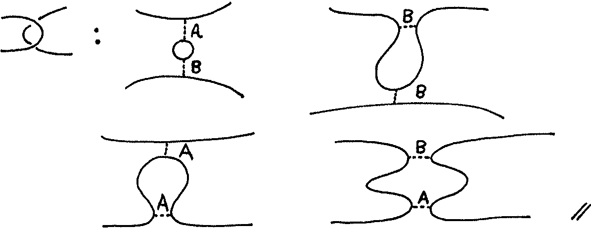

Hence we can achieve the invariance

$$
<\not\!\!C> = <\not\!\!C>
$$

by taking $B=A^{-1}$ and $d = -A^2 - A^{-2}$. A miracle happens, and we are granted invariance under the triangle move with no extra restrictions:

$$
\begin{align*} <\not\equiv> &= A <\not\equiv> + A^{-1} <\not\equiv> \\ &= A <\not\equiv> + A^{-1} <\not\equiv> = <\not\equiv>. \end{align*}
$$

Call this invariant the bracket polynomial [K3].

Note that the bracket polynomial is not invariant under the first Reidemeister move. It should be regarded as an invariant of framed links, whose framing is expressed in the plane. We have the formulas

---

$$
\langle \partial^- \rangle = -A^{-3} \langle \sim \rangle \\ \langle \sim \partial^- \rangle = -A^3 \langle \sim \rangle
$$

This allows normalization of the bracket by multiplication by a power of $(-A^3)$. Up to this normalization, the bracket gives a model for the original Jones polynomial [JO]. The Jones polynomial is denoted $V_K(t)$. The precise relationship with the bracket is [K3] that $V_K(t) = f_K(t^{-1/4})$ where $f_K(A) = (-A^3)w(K)\langle K \rangle(A)$ where $w(K)$ is the sum of the crossing signs of the oriented link $K$, and $\langle K \rangle$ is the bracket polynomial obtained by ignoring the orientation of $K$.

For braids, the bracket polynomial provides a representation, $\rho$, of the Artin braid group into the Temperley Lieb algebra with loop value $d = -A^2 -A^{-2}$.

$$
\rho(\sigma_i) = A U_i + A^{-1} \\ \rho(\sigma_{i-1}) = A^{-1} U_i + A
$$

The reader unfamiliar with this bracketology should compute the bracket polynomial for the trefoil knot and use this result to prove that the trefoil is topologically distinct from its mirror image. The mentions of the bracket polynomial in the body of the essay occur in sections 9 and 10. The Temperley Lieb algebra is introduced in section 2, remark 3. The representation of the Temperley Lieb algebra to the Artin Braid group is discussed at the end of section 7.

---

References

[A] Alexander, J.W. Topological invariants of knots and links. Trans. Amer. Math. Soc. 20 (1923), pp. 275-306.

[ASH92] Abhay Ashtekar, Carlo Rovelli, Lee Smolin. Weaving a classical geometry with quantum threads. (preprint 1992).

[AB] Aharonov, Y. and Bohm, D. Significance of electromagnetic potentials in quantum theory. Phys. Rev. 115. (1959). pp. 485-491.

[AC] Aczel, P. The Theory of Non-Well Founded Sets. CSLI Lect. Notes #14.

[AH] Aharonov, Y. and Susskind, L. Observability of the sign change of spinors under $2\pi$ rotations. Phys. Rev. Vol. 158. No.5. June 1967, p. 1237.

[ASH] Ashtekar, A. New Perspectives In Canonical Gravity. Bibliopolis (1988).

[At] Atiyah, M.F. The Geometry and Physics of Knots. Cambridge Univ. Press. (1990).

[BaS] Barbour, J. and Smolin, L. Extremal variety as the foundation of a cosmological quantum theory. (preprint 1992).

[B] Barendregt, H. The Lambda Calculus. North Holland Pub. Co. (1978).

[BX] Baxter, R.J. Exactly Solved Models in Statistical Mechanics. Acad. Press. (1982)

[BCW] Bauer, W.R., Crick, F.H.C. and White, J.H. Supercoiled DNA. Scientific American. Vol. 243. July 1980. pp. 118-133.

[BN1] Bar-Natan, D. Perturbative Chern-Simons Theory. (preprint 1990).

[BN2] Bar-Natan, D. On the Vassiliev knot invariants. (preprint 1992).

[BL] Birman, J. and Lin, X.S. Knot polynomials and Vassiliev's invariants. Invent. Math. (to appear).

[BO] Bondi, H. Relativity and Common Sense. Dover Pub. (1977).

---

[BR] Brieskorn, E. Automorphic sets and braids and singularities. Proceedings of Santa Cruz Conf. on Artin Braid Group. Contemp. Math. - AMS 78 (1988), pp. 45-115.

[BRI] Bricken, W. Boundary Logic and the Losp Parallel Deduction Engine. (manuscript 1984).

[C] Conway, J.H. An enumeration of knots and links. Computational Problems in Abstract Algebra (ed. J. Leech). Pergamon Press (1969). pp. 329-358.

[DH] DeHornoy, P. Free distributive groupoids. J. Pure and Applied Algebra. 16 (1989), pp. 123-146.

[FI1] Finkelstein, D. Coherent quantum logic. Int. J. Theo. Phys., Vol 26, No. 2 (1987), pp. 109-129.

[FI2] Finkelstein, D. Algebras and manifolds: differential, difference, simplicial and quantum. Physica 18D (1986) pp 197-208.

[FI3] Finkelstein, D. First flash. (preprint).

[F] Fox, R. A quick trip through knot theory. In Topology of 3-Manifolds. edited by M.K.Fort, Prentice-Hall Inc. (1962). pp. 120-167.

[FR] Fenn,R.A. and Rourke,C.P. On Kirby's Calculus of Links. Topology, 18 (1979), pp. 1-15.

[G] Gardner, M. Knotted Doughnuts. W.H.Freeman & Co. (1986). Chapter 5, pp. 55-67.

[GI] Gibson, J.R. Electronic Logic Circuits. Edward Arnold Pub. (1992).

[GK] Goldman,J.R. and Kauffman,L.H. Knots, tangles and electrical networks. Advances in applied mathematics 14, 267-306 (1993).

[H1] Hellerstein. N. Diamond - A Logic of Paradox. Cybernetic - Vol.1 No.1 (1985).

[H2] Hellerstein. N. N-Fold Logic or Paradox Island. (manuscript 1993)

---

[HY] Hocking, J.G. and Young, G.S. . Topology. Addison Wesley (1961) and reprinted by Dover Pub. (1988).

[JO] Jones, V.F.R. A Polynomial Invariant of Links via von Neumann Algebras. Bull. Amer. Math. Soc. 129 (1985), 103-112.

[JS] Joyal, A. and R. Street, R. Braided monoidal categories. Macquarie reports 86008 (1986).

[J] Joyce, D. A Classifying Invariant of Knots, the Knot Quandle. J. Pure and Appl. Alg. 23 (1983), 37-65.

[K1] Kauffman, L.H. Formal Knot Theory. Princeton University Press Mathematical Notes #30 (1983).

[K2] Kauffman, L.H. On Knots. Annals Study 115, Princeton University Press (1987).

[K3] Kauffman, L.H. State Models and the Jones Polynomial. Topology. 26 (1987), 395-407.

[K4] Kauffman, L.H. Statistical Mechanics and the Jones Polynomial. AMS Contemp. Math. Series (Proceedings of 1986 Conference on the Artin Braid Group - Santa Cruz, CA.) 78 (1989), 263-297.

[K5] Kauffman, L.H. An Invariant of Regular Isotopy. Trans. Amer. Math. Soc. 318, No.2 (1990), 417-471.

[K6] Kauffman, L.H. Knots and Physics. World Sci. Pub. (1991). Second Edition (1993).

[K7] Kauffman, L.H. Spin networks and knot polynomials. Intl. J. Mod. Phys. A. Vol. 5. No. 1. (1990). pp. 93-115.

[K8] Kauffman, L.H. Transformations in Special Relativity. Int. J. Theo. Phys. Vol. 24. No. 3. pp. 223-236. March 1985.

[K9] Kauffman,L.H. Knots, abstract tensors, and the Yang-Baxter equation. In Knots, Topology and Quantum Field theories - Proceedings of the Johns Hopkins Workshop on Current Problems in Particle Theory 13. Florence (1989). ed. by L. Lussana. World Scientific Pub. (1989). pp. 179-334.

---

[K10] Kauffman, L.H. Map coloring and the vector cross product. J. Comb. Theo. Ser. B. Vol. 48. No. 2. April 1990. pp. 145-154.

[K11] Kauffman, L.H. From knots to quantum groups (and back). In Proceedings of the CRM Workshop on Hamiltonian Systems, Transformation Groups and Spectral Transform Methods. ed. by J. Harnad and J.E. Marsden. Les Publications CRM (1990). pp. 161-176.

[K12] Kauffman, L.H. Map Reformulation. Princelet Editions (1986).

[K13] Kauffman, L.H. An integral heuristic. Intl. J. Mod. Phys. A. Vol. 5. No. 7. (1990). pp. 1363-1367.

[K14] Kauffman, L.H. Special relativity and a calculus of distinctions. In Proceedings of the 9th Annual International Meeting of the Alternative Natural Philosophy Association - Cambridge University, Cambridge, England (September 23, 1987). Published by ANPA West, Palo Alto, Calif. pp. 290-311.

[K15] Kauffman, L.H. Imaginary Values in Mathematical Logic. 17th International Symposium on Multiple-Valued Logic. IEEE Pub. (1987).

[K16] Kauffman, L.H. Self-reference and recursive forms. J. Soc. Bio. Strs. (1987), #10, pp. 53-72.

[K17] Kauffman, L.H. Reflections on reflexivity. (1990) (to appear).

[K18] Kauffman, L.H. Gauss Codes, Quantum Groups and Ribbon Hopf Algebras. Reviews in Mathematical Physics, Vol. 5, No. 4 (1993).

[K19] Kauffman, L.H. and Lins S. Temperley Lieb Recoupling Theory and Invariants of 3-Manifolds. Princeton University Press, Annals Series (1994).

[K20] Kauffman, L.H. and Magarshak, Y.B. Vassiliev knot invariants and the structure of RNA folding. (in Knots and Applications, ed. by L. Kauffman, World Scientific (1994)).

[K21] Kauffman, L.H. Map coloring, q-deformed spin networks, and Turaev-Viro invariants for 3-manifolds. Intl. J. Mod. Phys. B, Vol.6, Nos. 11&12 (1992), 1765-1794.

---

[K22] Kauffman, L.H. Spin networks, topology and discrete physics. In *Braid Group, Knot Theory and Statistical Mechanics II* (edited by Ge and Yang), World Sci. Pub. Co. (1994).

[KV] Kauffman, L.H. and Varela, F.J. Form dynamics. J. Social and Bio, Struct. (1980). Vol.3. pp. 171-206.

[K] Kelley, J. *General Topology*. Van Nostrand (1955).

[KH] Khovanov, M. New generalizations of braids and links. (preprint 1992).

[KI] Kirby, R. A calculus for framed links in $S^3$. Invent.Math.45 (1978),35-56.

[KM] Kervaire, M. and Milnor, J. Groups of homotopy spheres I, Ann. of Math. 77 (1963), pp. 504-537.

[KO] M. Kontsevich, M. Graphs, homotopical algebra and low dimensional topology. (preprint 1992).

[L] Laver, R. The left distributive law and the freeness of an algebra of elementary embeddings. Advances in Math. 91 (1992), pp. 209-231.

[LI1] Lickorish, W.B.R. A representation of orientable combinatorial 3-manifolds. Ann. of Math. 76 (1962), pp. 531-540.

[LI2] Lickorish, W.B.R. The skein method for 3-manifold invariants. Journal of Knot Theory and Its Ramifications. Vol.2 No.2 (June 1993).

[MTW] Misner, C.W., Thorne, K.S. and Wheeler, J.A. Gravitation. W.H. Freeman and Co. (1971).

[MO] Moise, E. *Geometric Topology in Dimensions 2 and 3*. Graduate Texts in Math. 47. Springer-Verlag (1977).

[O] Oshins, E. *Quantum Psychology Notes. Vol. 1: A Personal Construct Notebook* (1987). (privately distributed).

[P1] Pedretti, A. (editor) *Self-Reference on the Isle of Wight - Transcripts of the first International conference on Self-Reference* - August 24 -27 (1979), Princelet Editions.

---

[P2] Pedretti, A. Cybernetics of Language. Princelet Editions (1981). [In the I of Language. (2nd edition of Cybernetics of Language) (to appear)].

[PI] Charles S. Pierce. The New elements of Mathematics. Edited by Carolyn Eisle. Houghton Publishers, The Hague - Paris (1976) [part of a published collection of the works of Charles Sanders Pierce].

[PUL] Pullin, J. Knot theory and quantum gravity - a primer. (preprint 1993)

[R] Reidemeister, K. Knotentheorie. Julius Springer, Berlin (1932).

[RE] Reshetikhin, N.Y. Quantized universal enveloping algebras, the Yang-Baxter equation and invariants of links, I and II. LOMI reprints E-4-87 and E-17-87, Steklov Institute, Leningrad, USSR.

[S] Sumners, D.W. Untangling DNA. Math. Intell. Vol. 12. No. 3. (1990) pp. 71-80.

[RF] Fenn, R.A. and Rourke, C.P. Racks and Links in codimension two. Journal of Knot Theory and its Ramif. Vol. 1, No. 4 (1992). pp. 343-406.

[RZvL] Rosenfeld, I., Ziff, E. and van Loon, B. DNA for Beginners. Writers and Readers Pub. Inc. (1983).

[SH] Shannon, C.E. A symbolic analysis of relay and switching circuits. Trans. Am. Inst. Elec. Eng. 57 (1938), 713-723.

[S-B] Spencer-Brown, G. Laws of Form. George Allen and Unwin Ltd., London (1969).

[S-B(92)] Spencer-Brown, G. Private Communication

[S] Scott, D.S. Continuous lattices. In Toposes, Algebraic Geometry and Logic, Lecture Notes in Mathematics 274. Springer-Verlag, Berlin (1972). pp. 97-136.

[SM88] Smolin, L. Quantum gravity in the self-dual representation. Contemp. Math. Vol. 71 (1988), pp. 55-97.

[STA] Staley, F.J. Void. and Three Neomathematical Essays. (to appear)

---

[ST] Stanford, T. Finite-type invariants of knots, links and graphs. (preprint 1992).

[SU] Sumners, D.W. (editor). New Scientific Applications of Geometry and Topology. Proceedings of Symposia in Applied Mathematics. Vol. 45. American Math. Soc. (1992).

Evolution of DNA topology: implications for its biological roles. (article by N. Cozzarelli). pp. 1-16.

Geometry and topology of DNA and DNA-protein interactions (article by James H. White). pp. 17-38.

Knot theory and DNA. (article by De Witt Sumners). pp. 39-72.

[V] V. Vassiliev, V. Cohomology of knot spaces. In Theory of Singularities and Its Applications. (V.I.Arnold, ed.), Amer. Math. Soc. (1990), pp. 23-69.

[VF] von Foerster, H. Observing Systems. Intersystems Publications. (1981). Notes for an epistemology for living things., p 268.

[Wal] Walba, D. M. Experimental studies on the hook and ladder approach to molecular knots: synthesis of a topologically chiral cyclized hook and ladder.

[Wa2] Walba, D. M. Topological stereochemistry. 9.¹ synthesis and cutting "in half" of a molecular mobius strip (to appear in the New J. Chem.)

[Wald] Waldhausen, F. Gruppen mit zentrum und 3-dimensionale mannigfaltigkeiten. Topology 6 (1967), 505-517.

[WhR] Whitehead, A.N. and Russell, B. Principia Mathematica. Vol. 1, 2nd edition, Cambridge (1927).

[WIT] E.Witten. Quantum field theory and the Jones polynomial. Commun.Math.Phys. 121, 351-399 (1989).

[WITT] Wittgenstein, L. Tractatus Logico-Philosophicus. Routledge & Kegan Paul - London and New York. (1921), (1961).

[W] Winker, S.W. Quandles, Knot Invariants and the n-fold Branched Cover. Doctoral Thesis, University of Illinois at Chicago, Chicago, Illinois (1984).

---

